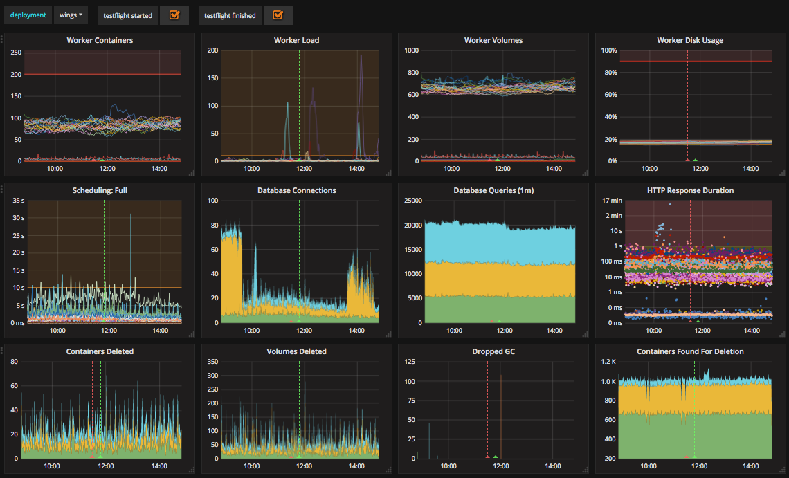

In April 2017 [the Concourse Crew](2017-09-29-the-concourse-crew--2017.md) set up a large BOSH deployment of Concourse
for internal use across Pivotal; we called this shared instance “Wings”. We started on this endeavor to iterate and
improve on Concourse as a large scale multi-tenant CI/CD solution, to drive out new features and to validate the Pivotal
supported BOSH release of Concourse.

<!-- more -->

After running an [inception](https://blogs.vmware.com/tanzu/inception-knowing-what-to-build-and-where-you-should-start/)
and talking about the goals, risks, and anti-goals, the team came up with the following goals:

* Better understand the ‘operator’ persona and the needs of an operator when running a multi-tenant Concourse
* Observe Concourse performance “at scale”
* Build out a set of recommendations for operationalizing, monitoring and logging a Concourse installation
* Identify common support issues and their solutions

These goals led us to identify a number of risks involved:

* Scaling too aggressively before monitoring is sufficient or an operator “god view” is in place.
* Not enough debugging information to gather in case of an incident
* Backing up user data in case of an emergency

## Day 1

With these goals and risks in mind, we set out on deploying Wings and providing teams to groups within Pivotal who
requested access. Since we ran an inception to identify goals and risks, we were already aware some key features we
would need as operators of a large deployment of Concourse.

Our initial BOSH deployment on [GCP](https://cloud.google.com/) had 2 ATCs, 5 Workers and a single PostgreSQL database
instance.

We mitigated the debugging and monitoring risks early on in the process of setting up Wings by adding metrics. Taking
advantage of our existing deployed [metrics infrastructure](../../../docs/operation/metrics.md), the team configured the
ATC, Workers and Database instances to report their stats to InfluxDB.


/// caption
Grafana dashboards on metrics.concourse.ci
///

We also configured a `blackbox` job for all of our ATCs and workers in the BOSH deployment manifest, which will send all
of the logs to [Papertrail](https://papertrailapp.com/).

```yaml
blackbox_job: &blackbox_job
  name: blackbox
  release: concourse
  properties:
    blackbox:
      syslog:
        destination:
          transport: tls
          address: ((papertrail_log_destination))
```

This job can be easily added to any of the instances we want to manage by referencing the YML anchor in the jobs list:

```yaml
jobs:
  - *blackbox_job
```

With our dashboard in place, we made it a habit to keep an eye on a few key indicators:

* The number of containers on any worker should not approach the 256 container limit
* Worker volumes and disk usage should remain relatively flat
* HTTP Response duration should remain flat ( and ideally below 100ms)
* Goroutines should not be leaked and pile up on the ATCs

## Day 2... and Beyond!

The “Day 2” experience of running a large Concourse brought us to some realizations about the scale of our deployment,
and what we will need to mitigate the risks we outlined as we scale.

Since one of our risks was “Backing up user data in case of an emergency”, and we saw some initial pressure and usage
growth on the database, we quickly switched to a more highly
available [Google CloudSQL postgres](https://cloud.google.com/sql/docs/postgres/) instance. This immediately provided us
with improved availability, scalability,
automated [backups](https://cloud.google.com/sql/docs/postgres/backup-recovery/backups#top_of_page),
and [automatic storage increases](https://cloud.google.com/sql/docs/mysql/instance-settings?hl=en_US&_ga=2.172987811.-1876883106.1502293380#automatic-storage-increase-2ndgen).

Wings grew very quickly within the month of operations. Starting off with only 7 teams, Wings had close to 20 teams by
the end of the first month. As we began to bear the burden of maintaining a large-scale multi-tenant Concourse for the
whole of Pivotal we adopted a single mantra: **“user pipelines aren’t the problem”**. We recognized that even though
they may cause operations and performance headaches, our users should be able to configure whatever pipelines they wish,
and Concourse should support them.

Since its more a “continuous thing do-er” than it is an opinionated CI/CD platform, we wanted users to let loose on out
a large Concourse deployment, and experiment, which led to some interesting pipelines:


/// caption
162 resources used by 2 tasks
///

An initial reaction I personally had to this pipeline
was “[um can you not?](https://media2.giphy.com/media/v1.Y2lkPTc5MGI3NjExbGltbGcwaDR1cmhmYmJ6YWtyNDFoa3dlZ2lwcnRnOGJ5azhheWxydCZlcD12MV9pbnRlcm5hbF9naWZfYnlfaWQmY3Q9dHM/aGpFSFsccblWU/giphy.gif)”,
but because we focused inward on operating and improving the product around users’ pipelines, we found and resolved a
number of issues:

1. [https://github.com/concourse/concourse/issues/1032](https://github.com/concourse/concourse/issues/1032)
2. [https://github.com/concourse/concourse/issues/1297](https://github.com/concourse/concourse/issues/1297)
3. [https://github.com/concourse/concourse/issues/1579](https://github.com/concourse/concourse/issues/1579)
4. [https://github.com/concourse/concourse/issues/1589](https://github.com/concourse/concourse/issues/1589)

This is just a small set of highlights along the way, and these issues would have been much more difficult to diagnose
without operating a large-scale deployment where users’ pipelines are a black-box to us.

We also identified the great need for more features in Concourse to support operators and open up _some_ visibility into
users’ pipelines. The “operator” role as it exists currently can log in to the “main” team, add more teams, and manage
the deployment infrastructure... and that's about it. There’s no easy way as an operator to gain insight into the types
of containers on workers, running builds in a pipeline, the volumes cached
in [baggageclaim](https://github.com/concourse/baggageclaim), and many more scenarios. This realization led to a much
more serious consideration and discussion
around [Fine-grained, Role-based Access Control](https://github.com/concourse/concourse/issues/1317), specifically to
support “operator” users.

## Service-Level Objectives

Even with our monitoring metrics in place, the Concourse Crew was still struggling with user-reported performance
issues. If our metrics were to be believed, Wings seemed to be operating within acceptable parameters. However, we were
still getting reports of slow pipelines, slow UI and build pages, and failures to hijack into containers.

With our early learnings on operating Wings, we reached out to the Pivotal CloudOps team for help. Their advice to us
was to define and track Service-Level Objectives for Wings.

Following the practices learned by working closely with Google’s Customer Reliability Engineering (CRE) initiative for
Pivotal Cloud Foundry, the CloudOps team helped us define the targets we want to meet, based on key user-facing actions.


/// caption
Wings’ SLO Targets
///

To monitor these objectives as Service Level Indicators (SLIs), we created a set of Concourse pipelines (of course) to
perform the user facing action and report back it’s success. These monitoring pipelines were hosted on a separate
Concourse deployment and reported up to a [Datadog](https://www.datadoghq.com/) a dashboard for office-wide visibility.


/// caption
Wing’s first month of SLO availability
///

You can check out our [pipeline setup](https://github.com/concourse/oxygen-mask/blob/master/pipeline.yml) for yourself
to see how this “Concourse pipeline to monitor a Concourse deployment” works!

The SLI dashboard led us to a series of investigations to improve Concourse performance. Starting off with our worst
SLI (view Build History), we discovered a few issues:

* Chrome is particularly bad at rendering the data being provided by Elm. If you have really large build histories the
  current workaround is to use Firefox [#1543](https://github.com/concourse/concourse/issues/1543)
* Our poor performance was in large-part due to inefficient queries against our PostgresDB. We were constantly hitting
  our database connection limit on CloudSQL. After a lot of debugging, we were able to fix this issue
  in [#1734](https://github.com/concourse/concourse/issues/1734)

In addition to a few more optimizations, our Wings instance runs a lot smoother, which is reflected by our SLIs
Dashboard.


/// caption
Hitting 3 out of our 5 SLO targets in the month of November 2017
///

## Key Takeaways

Today, Wings is operating with 3 ATCs, 30 workers, 5 external workers and 1 Cloud SQL instance on GCP. We support over
50 teams and hundreds of pipelines from all across Pivotal. We couldn’t have done this without establishing a measure,
learn and fix feedback loop on Wings. Getting all of this infrastructure took a lot of work and detracted from our
“usual” operations of working on issues and stories. But, it was all worth it because we were able to fix a lot of nasty
performance and stability issues by observing them happen in Wings.

The level of operational stability we achieved on Wings has also opened up new possibilities for the Concourse team. We
are now able to push experimental changes to Wings as a way to measure and observe changes at large-scales. This has
allowed us to pre-emptively catch bugs in our new features, and to get feedback on new UX features at-scale.

Great Success!