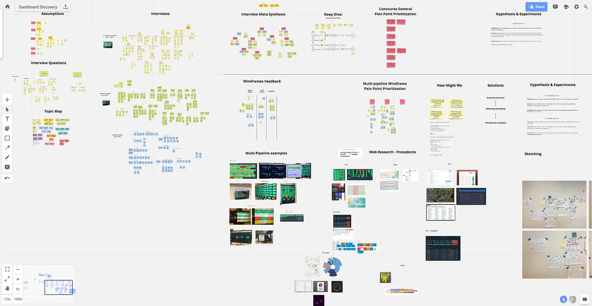
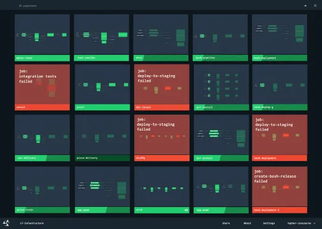
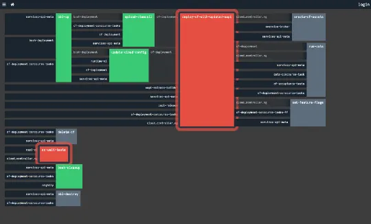
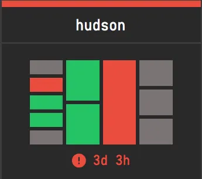
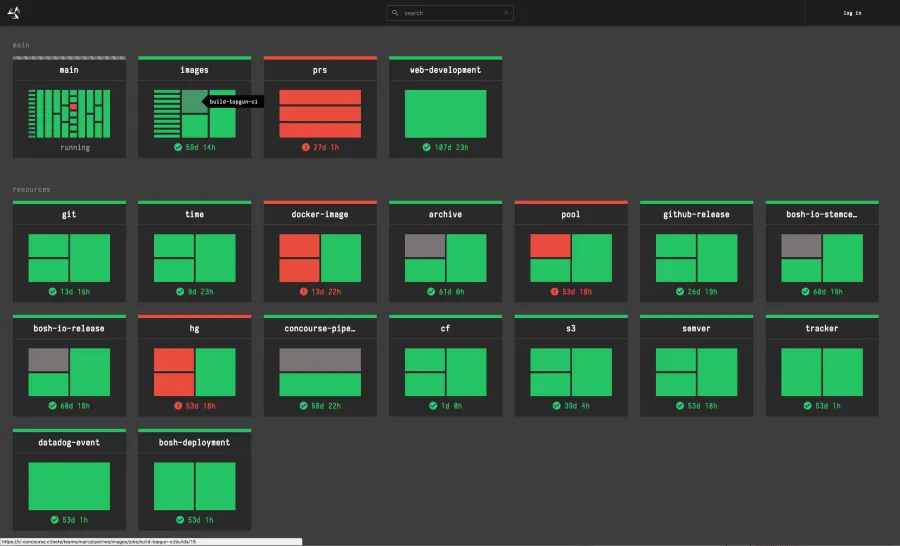

With the growing popularity of Concourse, we noticed that our development teams wanted to observe and monitor multiple
pipelines simultaneously. This behavior wasn’t limited to just Pivotal engineering teams; in fact, it was even more
prevalent amongst our Open Source Community. Our users currently solve this by cramming multiple browser windows into TV
their monitor view, or they use the [Concourse Summary](https://github.com/dgodd/concourse-summary) (aka Crystal) by
David Goddard of the Pivotal Buildpacks team.

<!-- more -->

/// caption
Concourse pipelines (left) Datadog and Concourse Summary (right) https://github.com/dgodd/concourse-summary
///

So, we embarked on a deeper Discovery effort with the goal of understanding and evaluating our assumptions around how
Concourse users were solving this problem today.

At Pivotal, we believe that products’ solutions need to be designed with the user in mind and we practice a style of
user-centered design that progresses in four phases:

1. **Learning**: How are Users are solving this problem today?
2. **Framing**: Formulate a hypothesis based on your learnings. Create a prototype or experiment that is based on the
   exploratory research.
3. **Assessing**: Put your experiment in front of users to see if your hypothesis is right.
4. **Iterating**: Repeat steps 1–3 to iterate on the solution as you get feedback.

## Learning: Understanding the Problem space

We began this process by thinking about the assumptions that were made about this feature and what we needed to validate
in our interviews.

* Users are not satisfied with the current single pipeline view — especially on a monitor vs. a dedicated CI display
  like a TV
* Only seeing red or green pipeline status is all that is important for pipeline summary
* Users want to understand the state of all their teams
* Users recognize their pipelines by their shape in the UI

/// caption
[Realtimeboard](https://realtimeboard.com/app/board/o9J_k0EAilo=/)
///

After we went out in the field to talk to users, we came back to synthesize our findings using this virtual whiteboard
tool called [Realtimeboard](https://realtimeboard.com/app/board/o9J_k0EAilo=/). One of our team members was remote, so
this tool allowed us to easily collaborate on our research.

> “Did it just turn red 10 seconds ago, or one week ago? I have no idea.” — _a Pipeline Engineer_

From our research, we found that users only care about failed jobs and the amount of time that their pipeline has been
failing. This information is crucial for engineering teams as it is used to triage their pipeline errors and influences
the prioritization of work. Many development teams we talked to are using a micro-service based architecture and
therefore most of their pipelines are composed of four jobs (build, test, deploy and health check). While we assumed
that the shape of a pipeline would be identifying, it was more important for the user to see the status.

Based on the feedback we collected we began to prioritize our insights and frame our solution. We proceeded to
brainstorm and sketch ideas for a prototype experiment.

/// caption
Early Dashboard prototype
///

Our first InVision prototype represented each team’s pipeline as a series of thumbnails. We believed this approach would
help users identify their pipelines, and at the same time have an at-a-glance view of the pipeline status. Our first
round of feedback from users revealed that the thumbnail was not as useful as we had thought, and our approach made it
more difficult to understand what the pipeline status was.

So, we pivoted and started to explore the idea of a pipeline thumbnail that abstracts the current pipeline
representation into a more substantial information radiator.

Alex Suraci, co-creator of Concourse, had been working on a UI experiment, based on a treemap chart (below), that looked
like something we could expand upon. I hypothesized that by removing the resources from this view and stripping down the
thumbnail to just jobs we could provide the user with just enough information for ‘at a glance’ triaging.

/// caption
Alex’s pipeline treemap algorithm experiment
///

/// caption
Thumbnail compression of the pipeline for the Concourse Dashboard
///

This was a radical idea with significant departures from the current visual style of Concourse. We didn’t want to just
“do it” and release it to our community of users without some kind of feedback first. As a product designer, my first
inclination was to start drawing up thumbnail variations that we could test with our users. However, there was no clear
taxonomy of pipelines because every team within Pivotal has a drastically different pipeline configuration. We needed a
quick way to test this design with “realistic” pipeline configurations at scale. Luckily for us, the Concourse team runs
an internally managed multi-tenant instance of Concourse [called Wings](2017-11-20-earning-our-wings.md). We use Wings
as a sandbox for new features, so I paired with an engineer to do a lightweight implementation for Wings.

Since our initial rollout of the dashboard on Wings in September 2017, we have undergone at least 3 major revisions of
the dashboard based on the feedback we had received from teams within Pivotal. Our next step was to incorporate this
dashboard into the core product as a beta feature without disrupting users who are looking for a more stable Concourse
experience.

As of Concourse 3.5.0 you can find the dashboard under `/dashboard/` and as of Concourse 3.6.0 you can find the
dashboard under `/beta/dashboard`. We hope you like this feature and are actively looking for feedback from the
community.

If you have a comment and want to participate in the conversation for the dashboard UI, please visit the issue in
GitHub: [https://github.com/concourse/concourse/issues/1829](https://github.com/concourse/concourse/issues/1829).