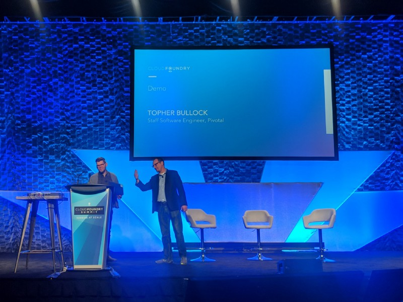

/// caption
///

<!-- more -->

Well, that was fun! [Topher Bullock](https://medium.com/u/58876cdc2180) absolutely _killed it_ last week on the CF
Summit 2018 main stage with his demo of the experimental Concourse ❤ ️K8s runtime project. We also had a great time
talking to companies who were using Concourse to continuously do things in the cloud. One of my favorite talks was from
Jason Immerman and Derek Van Assche from
Zipcar ([Concourse All the Things, All the Time](https://cfna18.sched.com/event/DdZz/concourse-all-of-the-things-at-all-times-jason-immerman-zipcar-derek-van-assche-hs2-solutions?iframe=no&w=&sidebar=yes&bg=no));
really inspirational stuff!

Now, on to the update.

We released [Concourse v3.12.0](https://concourse-ci.org/download.html#v3120) earlier this week. As usual it contains a
lot of new improvements; but notably this release fixes the earlier memory leak reported in v3.11.0. A few things to
highlight:

- We’ve been doing some work behind the scenes to improve our GC behaviour on workers. To do this we’ve started work on
  distributing container/volume garbage-collection across
  workers ([#1959](https://github.com/concourse/concourse/issues/1959)). This release has the early signs of this work,
  and we expect it to be done in just a few more weeks (tm). However, this DOES mean that you’ll need to open up port
  7799 on the worker in order to have workers behave properly with v3.12.0 (please see release notes for more details!)
- We also pulled in a change that made the git tag fetch behavior toggle-able…a lot of folks were hit by that so thanks
  to GH user [mdomke](https://github.com/mdomke) for the quick change!
- We think we finally hunted down some weird UI issues where certain versions of Chrome / Safari didn’t let you click
  into jobs. Let us know how that goes for ya’ll when you upgrade!

This week we’ve been cranking away at three key areas:

- Working on the visualization to spatial
  resources [https://github.com/concourse/concourse/issues/2131](https://github.com/concourse/concourse/issues/2131)
- Building out Users in Concourse with
  dex [https://github.com/concourse/concourse/issues/1888](https://github.com/concourse/concourse/issues/1888)
- Distributing GC across
  workers: [https://github.com/concourse/concourse/issues/1959](https://github.com/concourse/concourse/issues/1959)

On the design front, our team has been working on something that we call “design snacks”; minor changes to the UI that
could make big improvements to the overall experience with the app. Given our current tracks of work, we may not be able
to pick them up right away, but at least the designs are attached to issues for contributors to pick up; if they felt so
inclined :D

A few examples:

- Concourse pipeline groups should be
  responsive [https://github.com/concourse/concourse/issues/2130](https://github.com/concourse/concourse/issues/2130)
- Breadcrumb on Nav
  Bar [https://github.com/concourse/concourse/issues/2139](https://github.com/concourse/concourse/issues/2139)
- Paused jobs should indicate they’re paused on the build page(scroll to the bottom for that
  one [https://github.com/concourse/concourse/issues/1915](https://github.com/concourse/concourse/issues/1915)
- Build-level
  commenting [https://github.com/concourse/concourse/issues/2025](https://github.com/concourse/concourse/issues/2025)

As always, feel free to jump into the discussion on our
forum ([https://discuss.concourse-ci.org/](https://discuss.concourse-ci.org/)) or on
Discord ([https://discord.gg/MeRxXKW](https://discord.gg/MeRxXKW))

