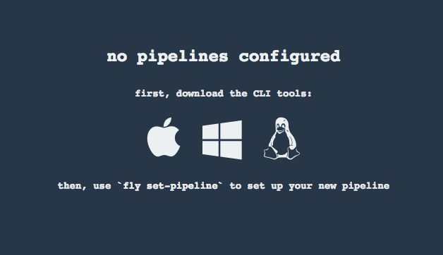
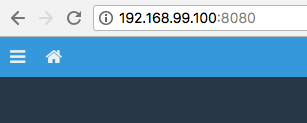
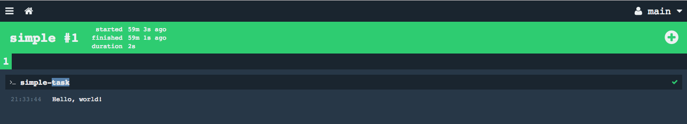

/// caption
///

If you haven’t checked out [Concourse][home] yet, you definitely should! Simple
primitives ([Resources][resources], [Jobs][jobs], [Tasks][tasks]), a heavy emphasis on [continuous workflows][pipelines]
defined by YAML, and an active & growing community are just some reasons why it’s worth taking a look. This is a quick
guide to getting an instance running on your machine in minutes.

<!-- more -->

## My Setup

* [Docker](https://docs.docker.com/docker-for-mac/install/) (docker version 18.04.0-ce, build 3d479c0)
* [Docker Machine](https://docs.docker.com/machine/) (docker-machine version 0.14.0, build 89b8332)
* [Docker Compose](https://docs.docker.com/compose/) (docker-compose version 1.21.0, build unknown)

As you can tell, I’m using Docker and its tools to handle all the heavy lifting.

Concourse has a [GitHub](https://github.com/concourse/concourse-docker) repository dedicated to compatibility with
Docker, so all that’s needed is to grab the right bits and let it do its thing! 🙌

!!! note

    Due to my lifestyle, I keep a few docker hosts active so I use Docker Machine. I’ve noted the difference that will 
    occur with the newer Docker implementation so you should be fine either way.

## Preflight Setup

Opening up the terminal and running `docker info` will make sure that Docker is ready and waiting.

```shell
$ docker info
Containers: 0
 Running: 0
 Paused: 0
 Stopped: 0
Images: 2
Server Version: 18.03.1-ce
```

!!! note

    If you get an error or timeout, take a gander at the 
    [Docker Machine docs](https://docs.docker.com/machine/get-started/).

## Setup Concourse

Grab the [quickstart Docker Compose file](../../../../docker-compose.yml) provided by Concourse and save it
as `docker-compose.yml`.

```shell
$ wget -nv -O docker-compose.yml https://concourse-ci.org/docker-compose.yml
URL:https://concourse-ci.org/docker-compose.yml [737/737] -> "docker-compose.yml" [1]
```

Run `docker-compose up -d` (The `-d` flag will run the containers in the background. If you’re interested in seeing the
logs, feel free to omit.)

```shell
$ docker-compose up
Creating network "concourse-quickstart_default" with the default driver
Pulling concourse-db (postgres:)...
latest: Pulling from library/postgres
2a72cbf407d6: Pull complete
...
Digest: sha256:836e78858b76bac4ab3c36a43488b0038cc54d7d459618781e3544fbc15c0344
Status: Downloaded newer image for postgres:latest
Pulling concourse (concourse/concourse:)...
latest: Pulling from concourse/concourse
d3938036b19c: Pull complete
...
Digest: sha256:9d91afe06ec5910ea7b187a6f4dbad9af0711334b19566e79667810f5adaa6ee
Status: Downloaded newer image for concourse/concourse:latest
Creating concourse-quickstart_concourse-db_1 ... done
Creating concourse-quickstart_concourse_1    ... done
```

By running `docker ps`, you can see that Docker Compose has conveniently setup two Docker containers; one for Concourse
and another for Postgres. All the ports, permissions, and credentials have been taken care of for us.

```shell
$ docker ps
CONTAINER ID        IMAGE                 COMMAND                  CREATED             STATUS              PORTS                    NAMES
b1a3e135ceed        concourse/concourse   "/usr/local/bin/dumb…"   11 minutes ago      Up 11 minutes       0.0.0.0:8080->8080/tcp   concourse_concourse_1
6a1ed198d47f        postgres              "docker-entrypoint.s…"   11 minutes ago      Up 11 minutes       5432/tcp                 concourse_concourse-db_1
```

!!! note

    If there is something already occupying the default port, adjust the `docker-compose.yml` file and try again.

That’s a fully functional local Concourse installation in two commands! Not bad so far. Now comes the fun part.

## Accessing Concourse

Docker Machine will let you know the address of the host by running `docker-machine env | grep HOST`. Copy it and add
the correct port for glory (ex. http://192.168.99.100:8080/).

!!! note

    If you’re using the newer Docker installation method for macOS, you should be able to go to http://127.0.0.1:8080/.


/// caption
///

Now you should be able to see your first glimpse of Concourse!

To install the Concourse CLI (`fly`) on your system, click on the Apple logo to download, and run the following
commands...

```shell
$ cd ~/Downloads/
$ install fly /usr/local/bin

$ which fly
/usr/local/bin/fly

$ fly -v
3.12.0
```

Last step is to login. Using the `fly login` command will help accomplish this.

```shell
$ fly login -t hello -u test -p test -c http://192.168.99.100:8080
logging in to team 'main'

target saved
```

!!! note

    The `-t` flag is a target alias and is required for almost every command. This alias comes in very handy when you’re
    targeting multiple concourse installations.

## Setting up a Pipeline

Grabbing a bare bones [Concourse pipeline][pipelines] is a good way to start kicking the tires. Luckily, there are lots
of examples to choose from in
the [Concourse repos](https://github.com/search?l=YAML&p=1&q=org%3Aconcourse+platform%3A&type=Code).

```shell
$ wget -nv https://raw.githubusercontent.com/concourse/testflight/8db3bc5680073ec4eb3e36c8a2318297829b9ce0/pipelines/fixtures/simple.yml
URL:https://raw.githubusercontent.com/concourse/testflight/8db3bc5680073ec4eb3e36c8a2318297829b9ce0/pipelines/fixtures/simple.yml [238/238] -> "simple.yml" [1]
```

You can now use `fly set-pipeline` to upload this pipeline to Concourse.

```shell
$ fly -t hello set-pipeline -p hello-world -c simple.yml 
jobs:
  job simple has been added:
    + name: simple
    + plan:
    + - task: simple-task
    +   config:
    +     platform: linux
    +     image_resource:
    +       type: docker-image
    +       source:
    +         repository: busybox
    +     run:
    +       path: echo
    +       args:
    +       - Hello, world!
    
apply configuration? [yN]: y
pipeline created!
you can view your pipeline here: http://192.168.99.100:8080/teams/main/pipelines/hello-world

the pipeline is currently paused. to unpause, either:
  - run the unpause-pipeline command
  - click play next to the pipeline in the web ui
```

Once completed, the output will let you know where to view the new pipeline. You’ll be prompted to login in the Web
Interface (GUI), but since this is a local instance the no authentication option is on by default. So you can just click
through.


/// caption
///


/// caption
///

You’ll see a single job pipeline called “simple” and the top navigation will be blue. This color confirms that you’re
pipeline is paused.

At this point, we’re able to do conduct actions like `unpause-pipeline` and `trigger-pipeline` via the web interface or
`fly`. For the sake of continuity, we’ll stick to `fly`. It’s also cool to see how the GUI reacts to your terminal
commands. 😬

```shell
$ fly -t hello unpause-pipeline -p hello-world
unpaused 'hello-world'
```

The navigation bar should lose its blue colouring at this point. Indicating that it’s ready to run jobs. This pipeline
doesn’t have any Resources that can trigger the “simple” job, so we’ll use `fly trigger-job` to do it manually.

```shell
$ fly -t hello trigger-job -j hello-world/simple
started hello-world/simple #1
```


/// caption
///

Concourse will schedule and run your job. Once complete, it ends with a mighty green box which is a developer’s
universal sign for victory.

Clicking on this job will give you a more detailed view.


/// caption
///

## Done

That’s all it takes to start from scratch with Concourse. This is just the start, there is [lots more to explore][docs]
to take full advantage of the [opportunities it presents](https://ci.concourse-ci.org/). Hope this helps, and thanks for
reading! 😊🙇‍♂️

## P.S.

If you `fly -t hello destroy-pipeline -p hello-world `and refresh your browser, you can check out its cool 404 page. 😎

[home]: ../../../../index.md

[docs]: ../../../../docs/index.md

[resources]: ../../../../docs/resources/index.md

[jobs]: ../../../../docs/jobs.md

[tasks]: ../../../../docs/tasks.md

[pipelines]: ../../../../docs/pipelines/index.md