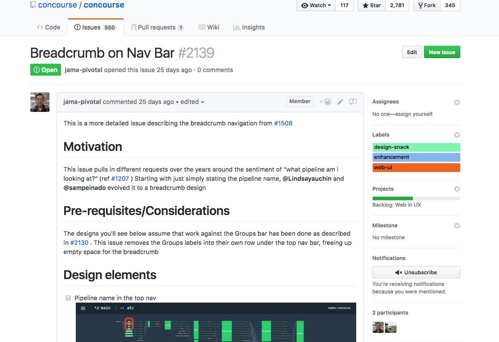

This past week a community member reached out to begin work on a PR for a UI change in Concourse. This sparked some
conversations within the team about how might we support this, since a lot of our design assets are private.

<!-- more -->

We started by tagging smaller, less risky issues in the backlog with a `design-snack` label. We hope that these
`design-snacks` make it more welcoming for contributors begin making UI contributions into the Concourse codebase.

/// caption
///

/// caption
///

## So, how do we get rid of the friction and make it an easy process?

We’re going to start by open sourcing the Concourse design system in this
repo: [https://github.com/concourse/design-system][design]. It’s a bit sparse for
now but we will be making more additions to it over the course of the coming weeks.

## Our Expectations

We’re hoping that this design system will give contributors some insight into our visual design philosophies.
Ultimately, we want to give contributors all the design assets they need up front so any discussions around a PR will be
feedback focused and not UI nitpicks. It’s going to be an iterative process, so don’t be shy in giving us feedback!

## Feedback

Stay tuned for more as we continue to update the design system. As always, feedback is welcome via issues in
the [design-system repo][design]!

[design]: https://github.com/concourse/design-system