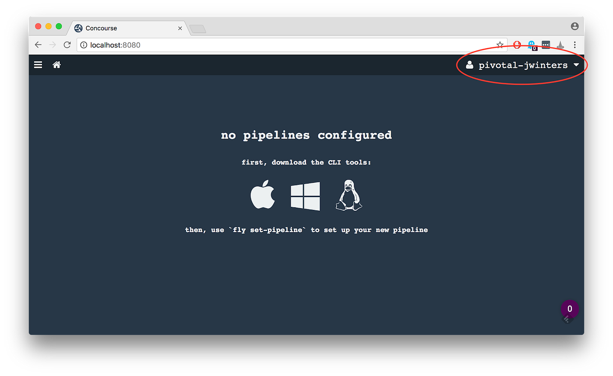

As most of you know we’ve been working hard on introducing Users into Concourse. Today, I’m excited to share with you
some of the changes we’ve made for an upcoming release of Concourse.

<!-- more -->

_In the old world, you used to log in as a team:_


/// caption
///

_Now you log in as a user:_


/// caption
///

_You can do this using external auth providers:_


/// caption
///

_Or logging in as a local Concourse user:_


How did we manage to accomplish this magic? With the power of [dex](https://github.com/coreos/dex)!

_In this new model:_

* We rely on dex to fetch the user’s identity and group affiliations from the external auth provider.
* We then take this information and cross reference against all Concourse teams to establish team memberships for the
  user.
* Team owners can whitelist external users and groups with the `fly set-team` command.

_What this doesn’t fix:_

* We still don’t have an easy way for people to identify what users/groups are currently whitelisted for a team. This
  should be something that we can add to the `fly teams` command in the future (PRs welcome), but in the mean time you
  can always check the database ;).
* We also aren’t implementing auditing or RBAC just yet...

_...but it's a good start!_

Now, let’s dive into some of the technical changes that might affect your continuous thing doing.

## ATC Startup

When you start up the ATC you will need to provide configuration information (i.e. `client_id`, `client_secret`, etc.)
for ALL auth providers that you want to use. Up to this point, each team would have to configure their own providers,
now the startup information will be shared across teams.

_If you want to use the GitHub provider, you will need to provide:_

```shell
atc ...
 --github-client-id client-123
 --github-client-secret 1234567890
 --main-team-github-group my-org:my-team
```

Note that the configuration of the `main` team is slightly different now too.

## Fly Set Team

Since providers are now configured at startup, the `fly set-team` command has gotten a whole lot simpler.

_You used to configure teams with all the provider information:_

```shell
fly ...
 --github-auth-client-id client-123
 --github-auth-client-secret 1234567890
 --github-auth-user my-github-login
 --github-auth-team my-org/my-team      # ← Note the slash “/”
```

_Now you simply whitelist a bunch of users and groups:_

```shell
fly ...
 --github-user my-github-login
 --github-team my-org:my-team           # ← Note the colon “:”
```

Yeah, sorry we changed the delimiter from a slash to a colon, but that’s what dex uses, so we went with it.

## Bearer Tokens

We’ve updated our bearer tokens to include the user’s identity and ALL their team memberships. Including their identity
will enable us to do auditing down the road. And having multiple teams in the token lets us update our APIs to return a
list of ALL resources visible to a user, not just those for a specific team.

_So the decoded token used to look like this:_

```json
{
  ...
  "isAdmin": true,
  "teamName": "main"
}
```

_And now it looks like this:_

```json
{
  ...
  "sub": "CgcxMDcyMjMzEgZnaXRodWI",
  "is_admin": true,
  "email": "user@email.com",
  "name": "Some User",
  "user_id": "1072233",
  "user_name": "my-github-login",
  "teams": [
    "main"
  ]
}
```

## No Auth

In the past, you could use the `--no-really-i-dont-want-any-auth` flag to disable auth for your team. This would allow
access to anyone without having to provide credentials.

In the new world, you can’t do this. We don’t allow access without credentials, and teams can no longer be open to the
public. You can, however, whitelist all authenticated users in the system using the `--allow-all-users` flag when
setting up your team.

## Fly Actions

The Fly experience does not change in our new auth system. You will still need to provide a target, which includes the
team that you are operating under for team-specific actions (such as `fly set-pipeline`, etc.).

## Exposed pipelines

The flow of setting and accessing exposed pipelines will remain unchanged. Exposed pipelines will still be visible to
the public, and do not require a user to be logged in.

## No provider left behind… sort of

For this track of work, we still need to implement some missing providers (dex calls them connectors) for external auth
systems. We’re hoping to have feature parity with the old providers, but we want to understand your use cases for
needing them first.

For example, Bitbucket Server may be problematic since it still relies on OAuth1. Now that we have more auth options (
hey we have an LDAP connector now), would current BitBucket users be willing to switch over to something else? Let us
know in GH issue [#1888](https://github.com/concourse/concourse/issues/1888).

## Feedback

For those who want to get caught up on the discussion, you can check out the GitHub issues:

* [Discussion; Fine-grained / Role based access control](https://github.com/concourse/concourse/issues/1317)
* [Investigate a new approach to Auth](https://github.com/concourse/concourse/issues/1886)
* [Rely on coreos/dex for third party integrations](https://github.com/concourse/concourse/issues/1888)

If you have any questions or concerns about the work that’s being done, feel free to drop a comment on those issues, or
reach out to us on our [usual channels](https://concourse-ci.org/community.html).