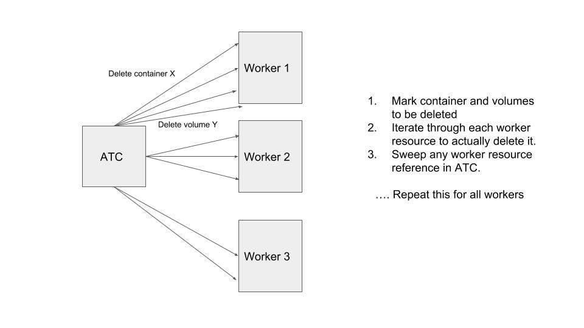
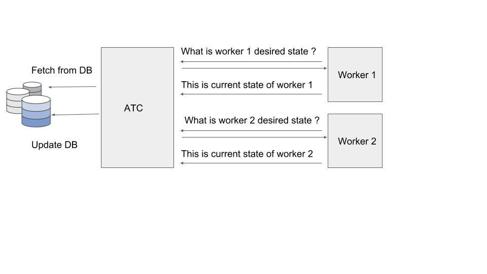
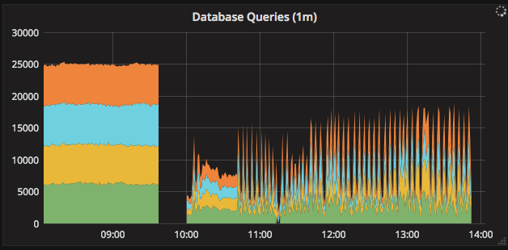
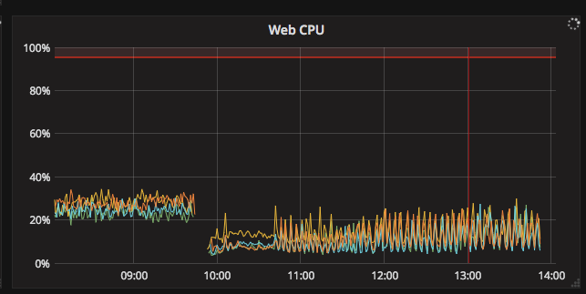

Before diving into the weeds of [Concourse architecture][concepts], let’s briefly take a look at container and volume
lifecycles in Concourse. Going forward in this post I will refer to container and volume together as a “worker
resource”. In the current architecture, there are multiple ways for worker resource creation to be triggered; like when
jobs are started in pipelines or checking for a newer version of a resource. The ATC is responsible for managing worker
resource lifecycle like creating, transitioning and destroying them. Workers are designed to be dumb and follow the
orders issued by ATC. Removal of worker resource on worker and its reference (in ATC) is done as part of Garbage
collection (GC) process in ATC.

<!-- more -->

GC in ATC includes cleaning up of finished builds, build logs, old resource cache, worker resource cleanup,
transitioning workers state etc. One of the classic techniques used for GC
is “[Mark and Sweep](https://en.wikipedia.org/wiki/Tracing_garbage_collection)”, it essentially marks the worker
resources that are to be cleaned up and then runs another process to actually remove them. In this post we are going to
dive deep into worker resource cleanup only. What are the conditions under which a worker resource should be marked for
removal? Few reasons could be that containers are around past the expiration time, corresponding volumes of past builds
that need not be cached, etc. Once the mark phase is done, ATC would connect
to [Garden server](https://github.com/cloudfoundry/guardian) (container management server)
and [baggage claim](https://github.com/concourse/baggageclaim) server (volume management server) on each worker and then
destroy worker resource iteratively.

During GC cycle, the number of outbound connections from ATC would proportionally increase with number of workers and
churn of builds. One potential solution is to increase the number of instances/vms of ATC to distribute load. The
problem with this approach is that GC synchronization requires mutex so ATC cannot reap the benefits of multiple
instances.

/// caption
Current Garbage collection process
///

What is the simplest thing that we could do to decrease the connections from ATC to worker instances?

One way would be to introduce a bulk destroy API on the worker for worker resources. We implemented a bulk destroy call
on the baggage claim server and Garden server so ATC needs to make just one network call for Sweep phase. It was
definitely a step forward in terms of reducing the number of network connections from ATC to worker.

We felt the present Concourse design was constricting us from making any further enhancements
to [GC](https://github.com/concourse/concourse/issues/1959). In current world, the ATC holds the desired state of the
system (i.e., number of worker resources that needs to be created for builds or resource checks). It also holds
information on what is the actual state of the system such as worker resources across all workers. The ATC is further
responsible for transitioning from actual to desired state too. We spent a significant effort to move this central
design system into more scalable and well balanced architecture. The first step towards this change was to make workers
smarter. We enabled worker with process to periodically poll the ATC for what is the desired state and also report their
actual status to ATC. This design will

1. Makes worker responsible for maintaining the desired state.
2. Reduce the amount of work to be done by ATC to maintain worker state.
3. Make workers more autonomous.

/// caption
Distributed Garbage collection process
///

We want to continue to make further enhancements on this path of work, and continue to give more power to the worker
process; like defining a CRUD API for worker resources. ATC is currently still responsible for creating worker resources
so hopefully (not so) far out in the future we can have worker resource APIs manage the lifecycle. This will also reduce
the intertwined dependency of ATC on Garden server API and baggageclaim server API. It will also also pave the path for
any [future container/volume management](https://github.com/concourse/rfcs/pull/2) systems to implement these worker
resource APIs.

## Success on [Wings](../../2017/11/2017-11-20-earning-our-wings.md)!

[Metrics](https://metrics.concourse-ci.org/dashboard/db/concourse?refresh=1m&orgId=1) from Concourse production
deployment before and after deploying GC changes.

/// caption
Database Queries by ATC (4 ATCs in this deployment) reduced by 40% after the deployment of GC changes
///

/// caption
CPU Utilization of ATC vm reduced by 10% after deployment of GC changes.
///

[concepts]: ../../../../docs/index.md