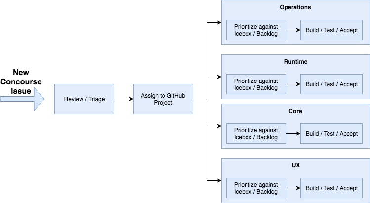

Building on some of our previous posts on the Concourse team mechanics[^1], I wanted to spend some time going over how we
actually _build_ Concourse.

<!-- more -->

### Tracking Features and Bugs

Concourse tracks all of its bugs, features and epics through GitHub Issues.

For items regarding the core functionality of Concourse itself, you can find the master issues list
here: [https://github.com/concourse/concourse/issues](https://github.com/concourse/concourse/issues)

For issues regarding the Concourse website and documentation, you can find the backlog
here: [https://github.com/concourse/docs](https://github.com/concourse/docs)

Concourse resources, both the ones [included with Concourse](https://resource-types.concourse-ci.org/) and the
ones that are [community made](https://resource-types.concourse-ci.org/), live in their own repositories.
Issues, bugs and features should be reported against the resource’s GitHub issues repo.

### Triage, Review and Prioritization

/// caption
///

We do our best to review and triage new issues that come into the Concourse repository on a daily basis. Triaging an
issue requires us to:

- Identify whether the issue is a bug or new feature (aka enhancement)
- Identify whether the issue requires more investigation
- Apply relevant labels for easier search down-the road (e.g. web-ui, fly, security, etc.)
- Follow up with any questions or comments if issue was unclear
- Connect issues to related issues already entered previously
- If applicable, assign to one of the [Concourse GitHub Projects](https://github.com/orgs/concourse/projects)

Issues assigned to a GitHub Project are automatically assigned into the project’s Icebox. The Concourse team follows a
very similar development approach
to [XP and Pivotal workflow](https://www.pivotaltracker.com/help/articles/workflow_overview/) where only active and
prioritized items are assigned to the Backlog, and all finished stories are required to be “Accepted” or “Rejected” by a
Product Manager or some other knowledgeable subject matter expert.

### Design & Research

Issues that require design and UX feedback are labeled with needs-design. These are usually picked up by our product
design team.

We also use the label design-snack on bite-sized UX/UI issues that are ready to be picked up by an engineer.
design-snacks aren’t highly prioritized issues but are nonetheless very useful for Concourse users!

Sometimes we work on big issues that require more research and testing before we can actually write issues. This work is
often tracked separately through various tools (both online and offline). We do our best to post updates in blog posts
and GitHub issues along the way.

### Iteration Planning Meeting (IPM)

The Concourse team conducts IPM every week on Monday afternoon. During this time we review each GitHub Project’s
backlog. This includes discussions on stories that were recently complete, are currently in flight, new stories added to
the backlog and any change in Backlog priorities. The Concourse team uses this custom-build project
view ([https://project.concourse-ci.org/](https://project.concourse-ci.org/)) as a way to quickly access the backlogs of
all our projects.

### Acceptance

Issues that are resolved are moved into the “Done” column of each project. This means that the issue is ready to be
reviewed for Acceptance. Typically, work that is ready for acceptance is reviewed on our “prod” instance, that
is, [https://ci.concourse-ci.org/](https://ci.concourse-ci.org/) The issue is typically reviewed by a product manager or
a subject matter expert who can determine whether the completed issue is acceptable for general distribution. Some
changes require additional load and/or “real-world” testing; in that case we deploy to Pivotal’s internal large-scale
Concourse “Wings”; which currently runs 3 ATCs, 38 workers and has \> 70 teams.

Rejected issues are returned to the top of the GitHub Project Backlog and commented on for revision.

### PR/Community

PRs and “Community” work (e.g. answering questions on Discord, our Forum, in GitHub issues) is usually handled by a
dedicated person. Currently this person is Alex Suraci (Product Manager). In addition to helping the community, he is
building out new proposals for long-term changes to Concourse in
the [RFCs repo](https://github.com/concourse/rfcs/pulls).

### What do we build?

In my next blog post, I plan on covering _what_ the core team is working on, how we make those decisions, and how we are
working to make those plans more obvious

[^1]: See The [Concourse Crew](../../2017/09/2017-09-29-the-concourse-crew-2017.md)
and [How the Concourse Team Organizes Issues](../../2017/10/2017-10-03-how-the-concourse-team-organize-issues.md)

