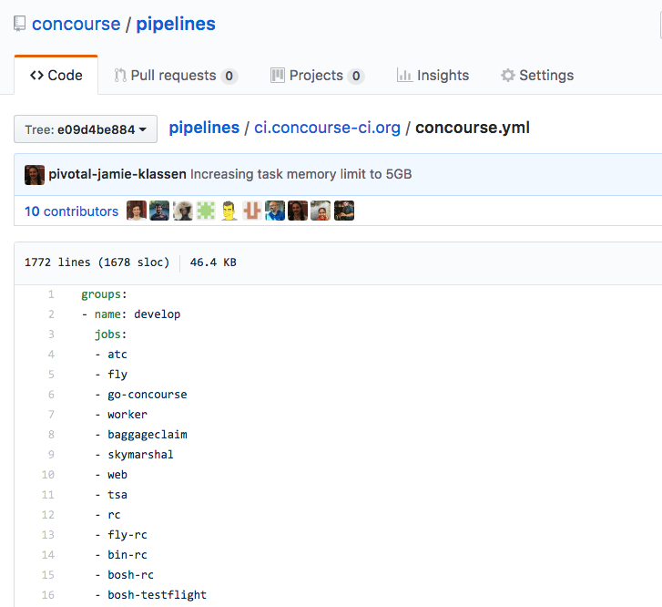
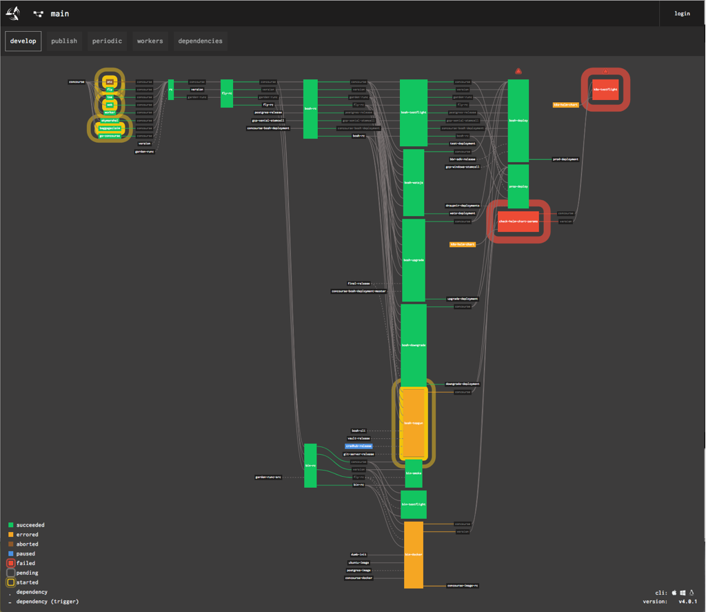
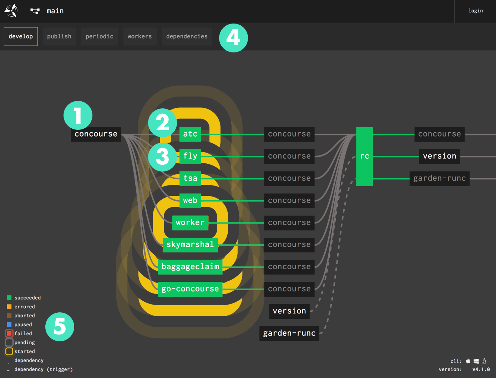
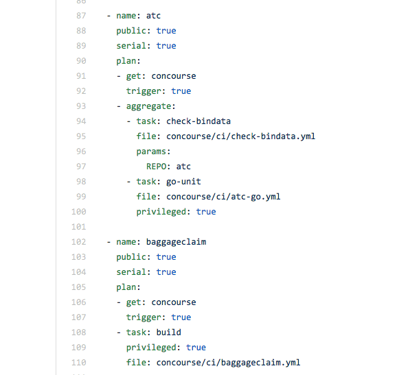
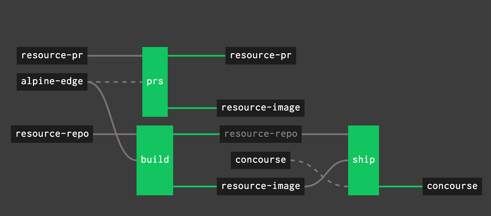
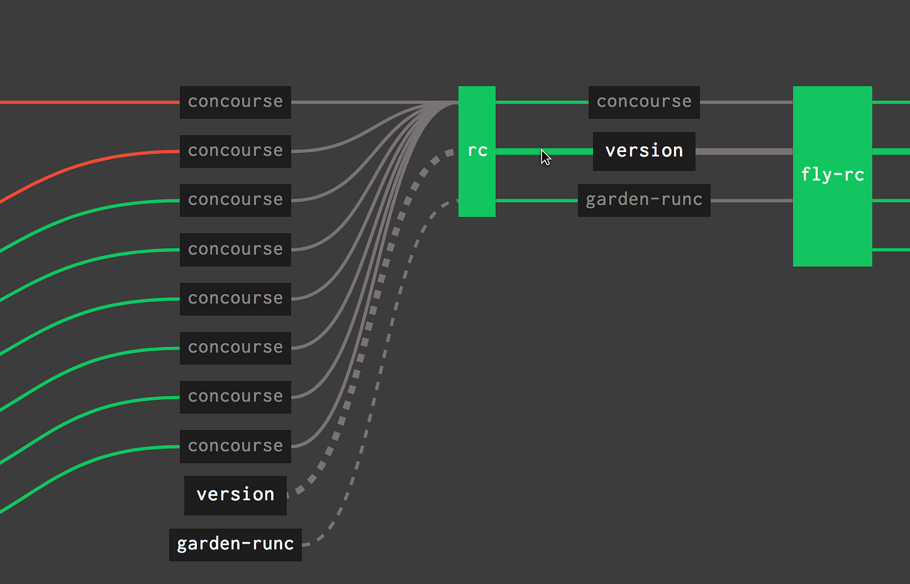
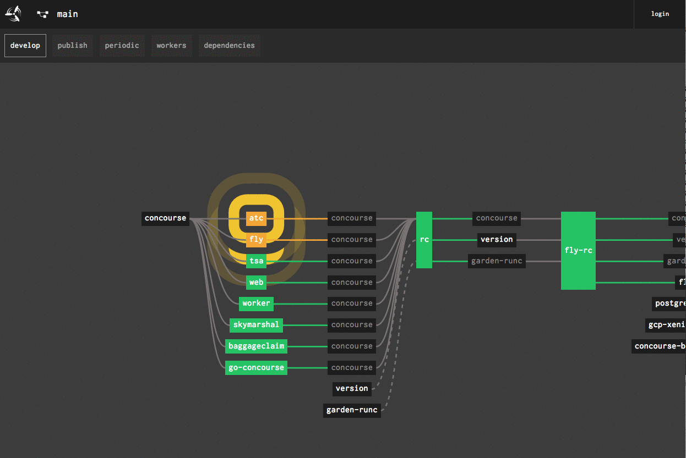
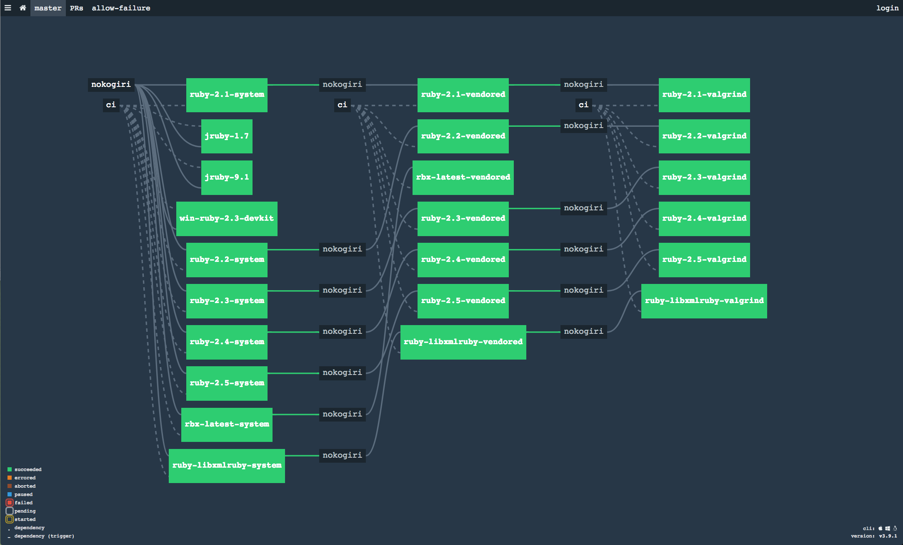

The Concourse UI is continuously growing and improving, and the goal of this article is to surface the latest design
elements of the Concourse UI. Using
our [production pipeline](https://ci.concourse-ci.org/teams/main/pipelines/concourse), it will become easier to connect
the mapping of an element to its meaning and purpose.

<!-- more -->

The primary function of the pipeline web view is to show the flow of versioned resources through the connected jobs that
make up a Concourse pipeline.

/// caption
Concourse Pipeline
///

## What is the Concourse Pipeline View composed of?

1. **Resources** and their corresponding state
2. **Jobs** and their corresponding state
3. **Running** state: Displayed as pulsating rings that appear yellow (running) and red (failed)
4. **Groups**: users can show/hide groups of jobs and resources configured in the manifest to create focused views of
   their pipeline
5. **Legend**: Mapping of colour to status of jobs and resources
    * **Fly CLI** download for Linux, OS and Windows
    * **Concourse** Version number

/// caption
///

## Actions Users can take on a pipeline

When users interact with this view they can take action to:

* Navigate to a **Resource** page
* Navigate to a **Build** page
* Hover to trace thread of a resource in the pipeline path
* Toggle view of groups
* Zoom, pan, and fit view (in Chrome you can use keyboard shortcut `f` to fit)
* Download the fly CLI for MacOS, Windows, Linux

## 1. Resources: Flow of artifacts through the pipeline

Analyzing the Concourse production pipeline, everything starts off with the `concourse` GitHub resource. In our
`pipeline.yml`, the `concourse` resource points to the main `concourse/concourse` GitHub repository.

/// caption
Concourse pipeline yaml (L) Concourse Web view (R)
///

As Concourse is able to reach GitHub and is in a healthy state, the resource is rendered as a black box with white text.

Zooming in on the beginning of the pipeline, we see that the `concourse` resource is connected to the `atc`, `fly`,
`tsa`, `web`, `worker`, `skymarshal`, `baggageclaim` and `go-concourse` jobs by a solid line. This means that when a new
version of the `concourse` resource is detected (a new commit into the repo), the subsequent jobs are automatically
triggered to run the tasks of the job in the worker container Concourse spins up.

/// caption
‘bump atc’ is the change that triggers the pipeline to kick-off
///

Resources reference external systems such as Git repos, S3 buckets, docker-images, Slack notifications, and timed
resources to name a few. These are rendered in the UI as a black box with white or grey text. The difference between
grey text and white text is that white text is the first instance of the resource in the pipeline and is typically where
a new version will appear. Subsequent references to that resource will be grey text; it is now a subset of something
that appeared before it in the pipeline.

In our example, the `concourse` resource that is inputted to those jobs, is repeated to indicate that it is being
transferred to the next job (`rc`), and thus has grey text.

/// caption
Errored Resource
///

**Resource errors** are indicated in the interface by the resource box turning amber with white text. This means there
is something wrong at the resource level, and it’s time to do some investigation as to why.

Paused resources are rendered in the UI as a blue background to the resource box.

## 2. Jobs

Jobs are the execution phase of the pipeline and are composed of tasks and resource actions (get, put) defined in
the [build plan][jobs]. The pipeline view today is Job Centric, allowing the app developer to monitor their code as it
progresses through various jobs.

/// caption
///

## Connecting Jobs & Resources

In Concourse, versioned resources connect to jobs through the input and output parameters. In our pipeline view, we can
visually represent this as lines connecting jobs with resources in-between. A user can trace the path of a resource by
hovering over one of these lines; exposing the full path of a resource across jobs.

/// caption
Lines connecting the Resources to Jobs
///

### Triggering vs non-triggering

Not all jobs are triggered automatically by incoming resources. This behaviour is typically specified in the pipeline
yml as [`trigger: true`][get]. This is represented as a _solid line_ between jobs. When a job is `trigger: false`, this
relationship is represented by a _dotted line_ between jobs.

## 3. Running State:

A **yellow halo** pulsating out from the job box indicates that the job is in a running state. This gives the user an at
a glance view at what jobs are running in real time. A job could be kicked off as a automatic trigger, or a manually
triggered job.

/// caption
Running state halo
///

## 4. Navigation and Groups:

The Concourse propellor in the top navigation lets a user navigate to the dashboard via the concourse logo.

**Groups**: Jobs can be [grouped][group] in the pipeline yml for better visibility. In the pipeline view, multiple
groups can be selected by `shift` selecting the group names.

/// caption
Groups on the pipeline view
///

## 5. Legend

/// caption
///

We have found that users want a visual reminder of what the various job states and visual indicators mean in the
pipeline UI. The colours of the job boxes indicate to the user their state.

**Green** indicates that the job has succeeded

**Red** indicates that the job has failed

**Orange** indicates that the job or resource has failed. We use this convention so that users will learn to trust their
job failures (red).

**Blue** indicates that the job or resource is paused. This indicates to the user that a job or resource has
intentionally been paused, causing a disruption to the normal build cycle in their pipelines

**Brown** indicates that a user has cancelled a job.

**Grey** indicates that a job is pending.

The **yellow halo** surrounds a job to indicate that the job is running.

**Red halo** indicates that the job was running and has failed. In order to help with colour blindness we also added a
handy fail icon; represented by a warning triangle at the top of the job column.

## Different pipelines for different teams

No two pipelines are rendered the same in Concourse. The visualization of the pipeline is displaying how a team does CI
and their unique path to production.

## Feedback

Stay tuned for more UI explained in this series as we tackle the Resource page the Build page next! As always, feedback
is welcome via issues in the [concourse](https://github.com/concourse/concourse)
and [design-system repo](https://github.com/concourse/design-system)!

[jobs]: ../../../../docs/jobs.md

[get]: ../../../../docs/steps/get.md

[group]: ../../../../docs/pipelines/index.md##group_config-schema