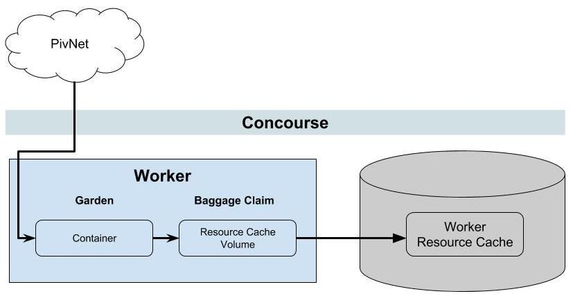

This is a follow-up to [James Ma](https://medium.com/@jama.22)’s post
on “[Suspicious Volume Usage on Workers](2018-08-10-suspicious-volume-usage-on-workers.md)”. James also helped out with
the illustrative diagrams for this post!

<!-- more -->

The Concourse team commonly gets questions about how Concourse treats resource caching on workers. For example, consider
this scenario:

> If **3 pipelines** on **3 teams** use the **_same_ resource** (let’s say the [
`pivnet-resource`](https://github.com/pivotal-cf/pivnet-resource)) with the same source configuration (e.g.
`product_slug: p-metrics`); does Concourse download and store the resource (the `p-metrics` tile) **3 times** and store
**3 cached volumes** individually?

Let's dig in to how this works under the hood:

When Concourse needs to fetch a version of a resource a new container is spun up and allocated to a worker. This new
container will be used to download the new version of the resource into the newly created **Resource Cache Volume** on
the Baggage Claim portion of the worker. The reference to the **Resource Cache Volume** is stored in DB as an entry in
the **volumes** table, referenced by the `worker_resource_cache_id` column.

/// caption
For simplicity only the Worker and Database are shown; other components like ATC/TSA are not present
///

As a rule of thumb the number of times a resource version is downloaded depends on:

* How the jobs from the 3 teams are scheduled across the pool of workers
* Whether the resource configuration across teams and pipelines is identical

Consider the same scenario described above, where we have three different pipelines from three different teams running
on the same Concourse instance.

Each pipeline is defined to use the [`pivnet-resource`](https://github.com/pivotal-cf/pivnet-resource), but are
configured to reference different product slugs. For simplicity, suppose the ATC has allocated each “resource get” on to
three separate workers:

/// caption
///

As you can expect, because the steps happen on **_different_ workers**, the **3 _different_ products** are downloaded to
**3 _distinct_ worker resource cache volumes**.

What happens when **Pipeline 1** and **Pipeline 2** get steps are allocated onto the same worker?

/// caption
///

In this scenario, the files for the two resources are downloaded onto the same worker, while the third worker remains
empty.

Let’s consider one more scenario. **Team 2** updates **Pipeline 2** to download `p-metrics` as well; and they end up
having _**identical resource configs**_, secrets and all (assuming they use the same API token):

/// caption
///

In this case, Concourse is aware that the two teams have set pipelines with **identical resource configs**. This results
in a **single volume** where `p-metrics` is only downloaded once. This is safe to do because resource cache volumes are
only ever mounted into tasks Copy on Write (COW) volumes, so the original source can’t be mutated.

A `get` step will correspond to a `resource_cache` entry in the database, which associates the version and any params to
the `resource_config` in the database.

## I thought pipelines were isolated! What about my team’s [secrets](https://media.giphy.com/media/xT9KVIKY0CUKtrltYs/giphy.gif)?

`resource_config`‘s hash the source with the secret values interpolated. If the values of the secrets are the same
they’re considered the same `resource_config`. So if 2 teams use the same git resource private key, they’ll share the
worker resource caches of a version of that git resource. All a user would be able to see is the credentials they
configured and know are there, which they can already retrieve in other ways. As a user, I have no way of knowing
whether someone is using the same secrets I’m using.

We’re actively considering moving this behaviour up the chain, and having
identical [resources share their version history across teams](https://github.com/concourse/concourse/issues/2386).