Continuing on our [Concourse UI Explained](2018-08-17-pipeline-ui-explained.md) series, this week we are taking a look
at a Concourse [`job`][jobs]’s [`build`][build] page. As always, we will be using
our [production pipeline](https://ci.concourse-ci.org/) as a guide to connect the mapping of an element to their meaning
and purpose.

<!-- more -->

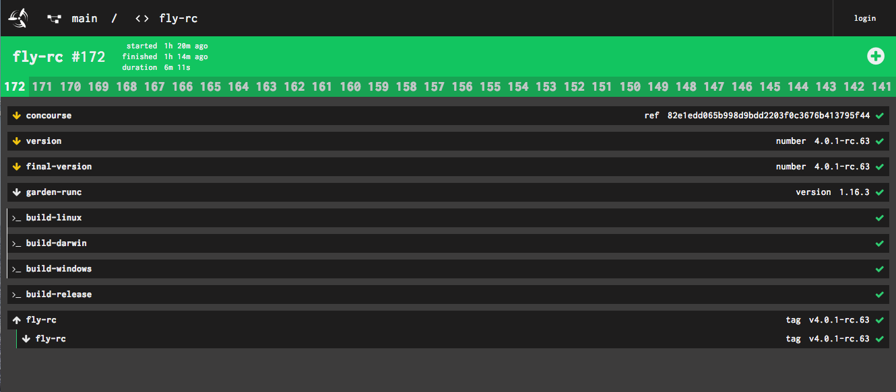
/// caption
Fly-rc build page in the [ci.concourse-ci.org](https://ci.concourse-ci.org/) production pipeline
///

## What is in a Build?

As we discussed previously in the [Concourse Pipeline UI Explained](2018-08-17-pipeline-ui-explained.md), Concourse
helps developers visualize the flow of artifacts across [jobs][jobs] and [builds][build]. Jobs determine the actions of
your pipeline, how resources progress through it. Every [job][jobs] has a [build][build] plan that determines the
sequence of steps to execute the job.

In Concourse, the execution of a job and its build plan can be viewed on the Build page for that job. As the build plan
executes, information pertaining to the build progress e.g. [`get` steps][get], [`put` steps][put], and [
`task` steps][task] is updated in real time on the build page itself.

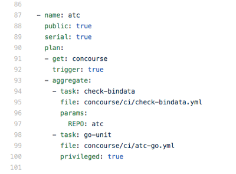

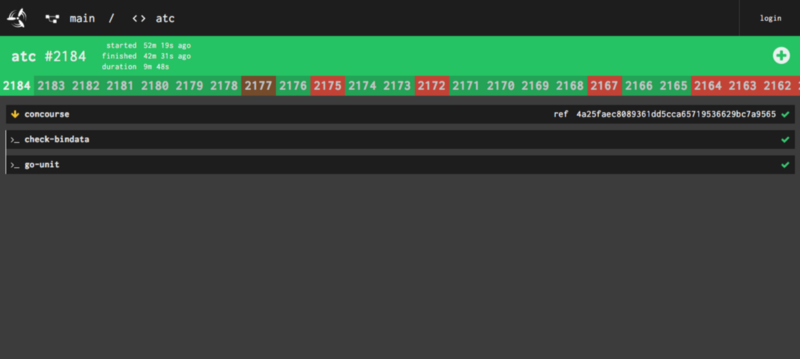

/// caption
The yml build plan for the [ci.concourse-ci.org](https://ci.concourse-ci.org/) production pipeline.
///

Using our production pipeline for Concourse as an example, the syntax for the job `atc` consists of the following steps:
getting the resource concourse pulled from the `concourse repo` and running `check-bindata` and `go-unit` tests.

As a user, I want to monitor this build so, in the web UI, I can select the `atc` job box from the pipeline UI to
navigate to the build page for the `atc` job.

/// caption
///

This is where an engineer can find the resource version, input versions that have passed, metadata for that version,
output of results and logs of that build which is composed of integration and unit tests.

### What is this View composed of?

1. **Build status** displayed as the background colour as the top banner
2. **Job name, build number** and **build metadata** (started, finished, duration)
3. Rendering of the [`yml build plan`][pipelines] as **Input** resources and **Outputs**.
4. Historical builds — the results of recent builds of that job. Did you know you can scroll that list with the mouse
   wheel? Give it a shot!
5. **Output Logs** for current and past builds that are coloured and time stamped for debugging

/// caption
///

### Actions Users can take:

* Users can abort a build by selecting the `x` button when the build is preparing to run or currently running.
* Users can trigger a new build by clicking the `+` button on the web UI of a job
* Share specific build outputs with your team members. Selecting multiple lines of output in the logs will update the
  URL to reflect the line's users have selected and they can then use this URL to share out specific outputs.
* Past builds are numbered and coloured with the past resulting status of each build. Users can select a previous build
  in the tabbed horizontal list.

## Build Status

### Status of a Build

The coloured banner behind the job name and build number gives the user an at a glance understanding of the status or
stage of a build in real-time.

A build has multiple stages: Pending, Running, Paused, Failing, Errored, and Aborted.

### Pending Builds

**Pending** due to waiting on ‘passed’ constraints or new versions of a resource is indicated in the UI by a grey status
in the banner of the build and in the metadata. When a build is kicked off the first feedback the user will see that a
build is pending.

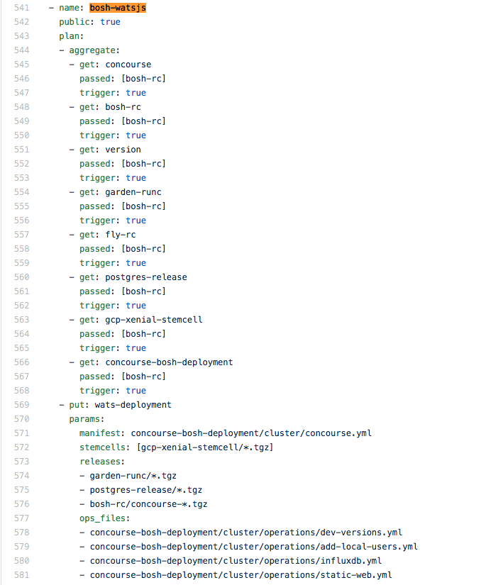

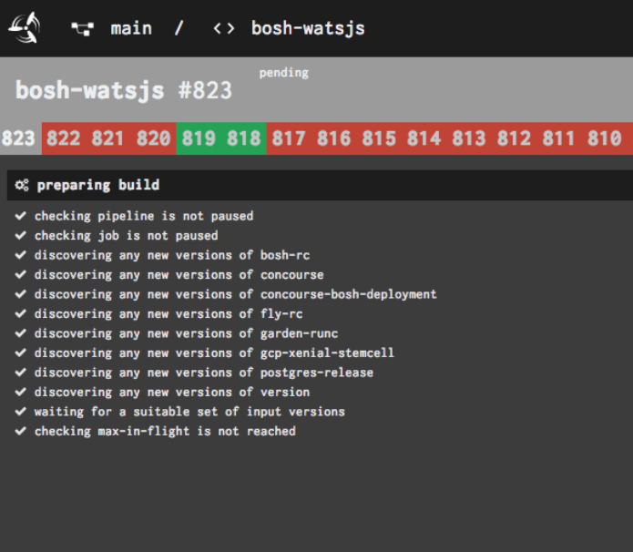

/// caption
In this example, the `bosh-watsjs` build is pending on new versions as described in the pipeline.yml
///

### Running

**Yellow** indicates that the job is running and logs will begin to stream in real-time to the user.

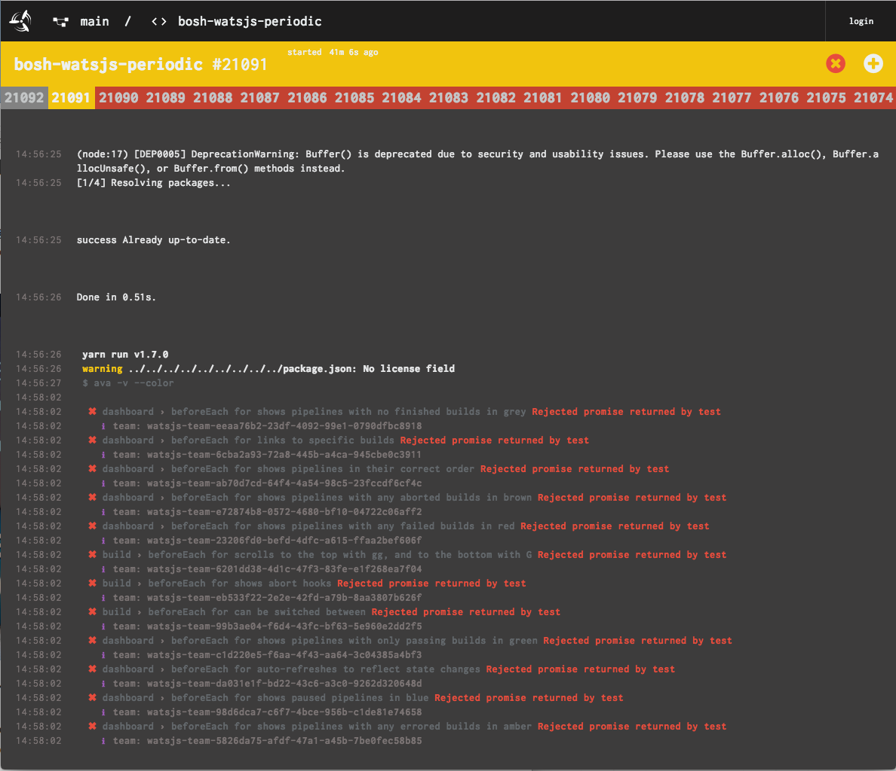
/// caption
///

### Succeeded

**Green** indicates that the job has succeeded and the job is complete. **Red** status in the banner tells the user that
the job has failed at some point of the build.

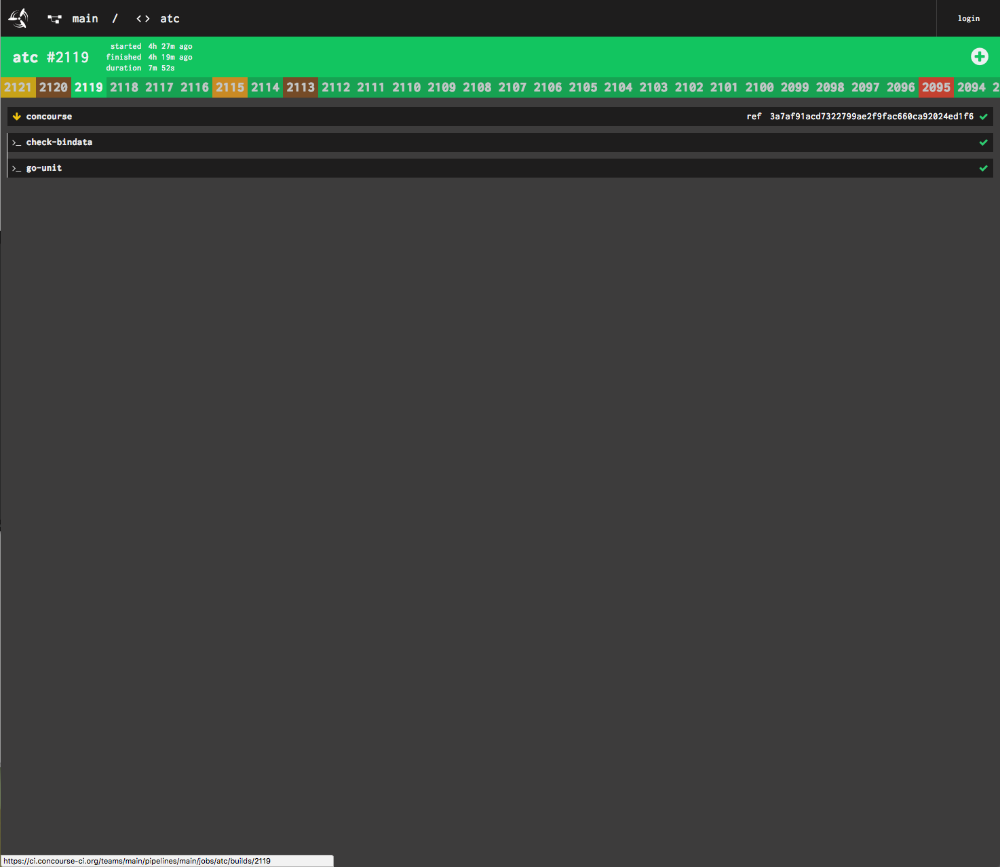

/// caption
Success Green (L) Red failing (R)
///

### Error

**Orange** indicates that something went wrong internally when trying to run the build. This is different from **Red**
so that the user can trust that all **Red** failures are a result of misconfiguration/bad code and are something that
they likely need to fix.

### Aborted

Aborted builds have a **brown** banner. Builds are aborted when a user stops the job in the UI or through the `fly` CLI.

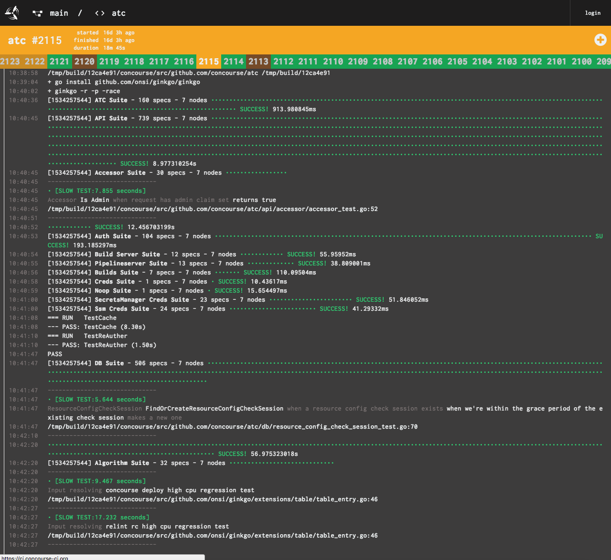

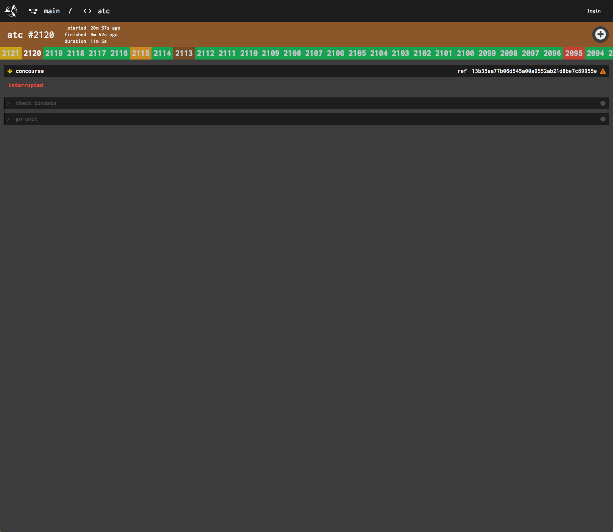

/// caption
Error (L) Aborted (R)
///

The Build states are also reflected as browser Favicons for easy scanning when a user is in another tab of the browser.

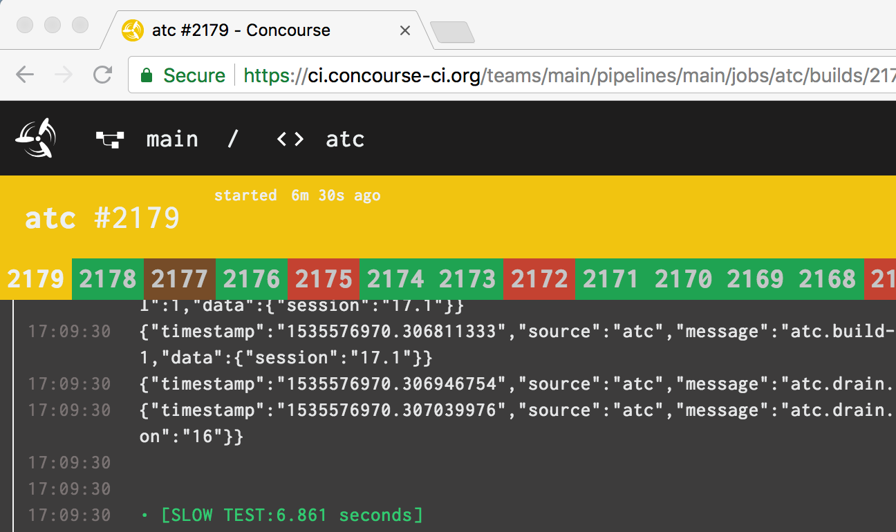

## Logs

Users are looking to the logs to see that tests are working the way they expect them to and when they fail what point
did that failure occur.

When a user navigates to a failed build the browser automatically scrolls to the line of the log which is failing
because the output logs can be very, very long.

Concourse uses colour coding for consistency with the output of the terminal and visual parsing when debugging.

Timestamps on the left of the logs are reported against each line of output using the users browser reported timezone.
These are important when debugging as a user; because I want to know how long individual actions are taking while they
are doing the build and running tests.

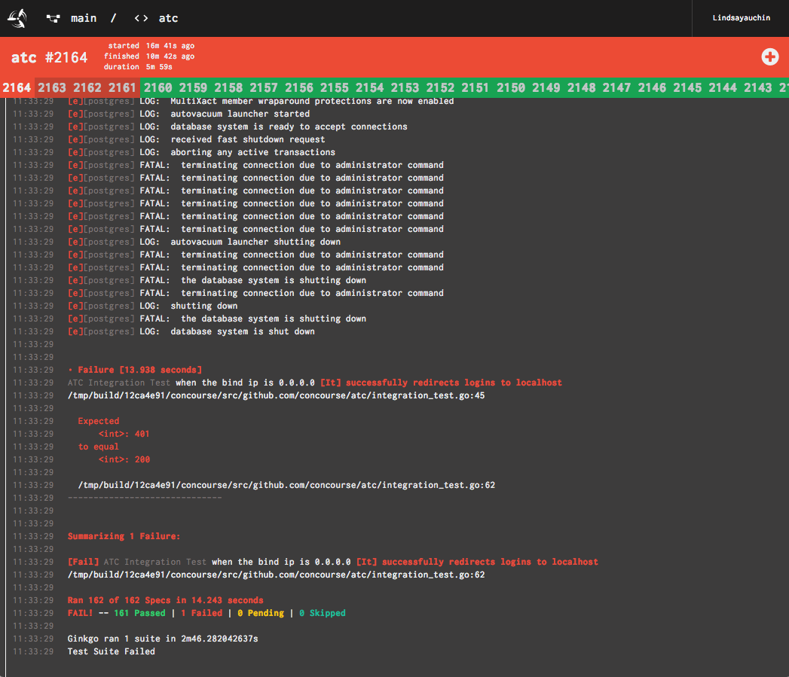
/// caption
///

## Triggering / Aborting Builds

A job can be **triggered by** clicking the `+` button on the web UI of a job on the build page. Users also have the
power to **abort** the build in the web UI.

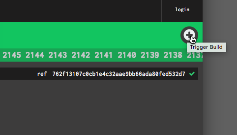

## Build History

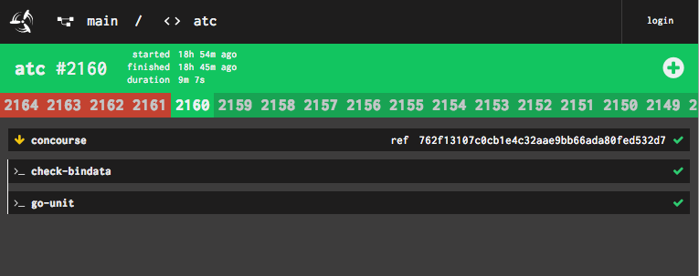
/// caption
///

Build History is listed in descending order as horizontal tabs. Users can scroll through them using the mouse wheel to
access older build histories.

For jobs with lots of build histories, older logs may have been reaped. This can be specified the [
`build_logs_to_retain`][jobs] parameter on a job.

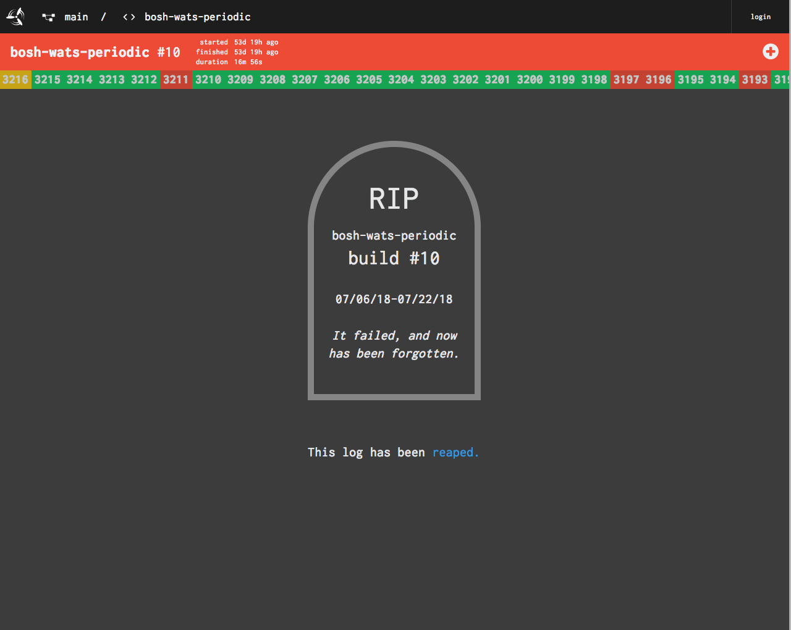
/// caption
you served us well `bosh-wats-periodic #10`
///

## Iconography in the Build

1. New versions are indicated by a yellow down arrow preceding the name
2. Older versions to this job are white arrows
3. > _ indicates a task
4. Successful check of a version

/// caption
///

## Keyboard shortcuts

The build page also supports basic vim-style keyboard shortcuts as well. You can bring up a reference menu using `?` or
`SHIFT + /`

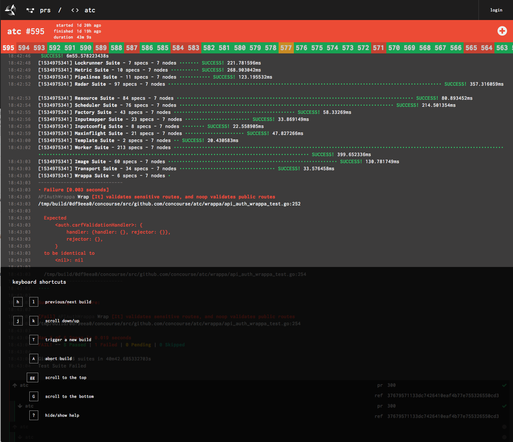
/// caption
///

The supported **keyboard shortcuts** are:

* `h` and `l` for previous/next build
* `j` and `k` for scrolling up and down
* `T` to trigger a new build
* `A` to abort the build
* `gg` to scroll back to the top of the page
* `G` to scroll to the bottom of the page
* `?` to toggle the keyboard hint on and off

## Feedback

Stay tuned for more UI explained in this series as we tackle the Resource page next! As always, feedback is welcome via
issues in the [concourse](https://github.com/concourse/concourse)
and [design-system repo](https://github.com/concourse/design-system).

[build]: ../../../../docs/builds.md

[pipelines]: ../../../../docs/pipelines/index.md

[jobs]: ../../../../docs/jobs.md

[get]: ../../../../docs/steps/get.md

[put]: ../../../../docs/steps/put.md

[task]: ../../../../docs/steps/task.md