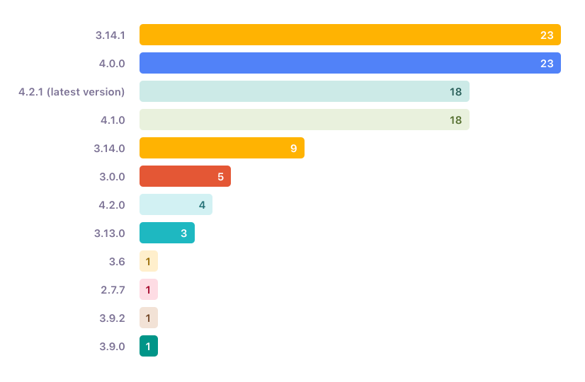
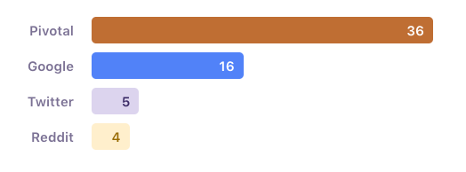
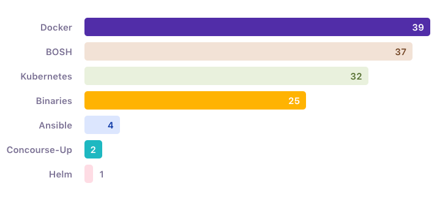

About a month ago, we sent out a Concourse Community survey in order to gain insight into our users and measure our
growth over the previous year. We received tons of great feedback from the OSS Community, Pivotal customers, and fellow
Pivots. We gained a lot of valuable information from the survey and we’re excited to share our findings.

<!-- more -->

Before diving into the results, the Concourse team wanted to send a big shoutout to everyone who responded. At the time
of this writing, we’ve received over 100 responses and that number is still climbing. Your contributions are more than
appreciated and will help us make Concourse even better in 2019 and beyond.

## Verticals / Lines of Business

/// caption
Users / Vertical
///

As expected, the vast majority of respondents were from traditional technology industries. However, we still saw
responses from a diverse spectrum of businesses (Retail, Aerospace, Media, among others). It was encouraging to see the
wide array of use-cases Concourse is being utilized for.

## How Long Have You Used Concourse?

/// caption
///

Most of the people who responded indicated they had been using Concourse for one year or less. That being said, about
40% of the responders have been using Concourse for 2+ years. It was important to grab feedback from both newbies and
original contributors as these varying levels of experience added valuable depth to our data. These users have different
pain-points in how they operate Concourse, so it was important to gain these differing perspectives.

## What Version Of Concourse Are You Using?

/// caption
Version of Concourse
///

Of those that disclosed what version they were using, around 60% had already upgraded to at least 4.0 (our last major
release). Given that a number of the respondents were running Enterprise-scale Concourse deployments (more on that
below), this was an encouraging number.

## Where Did You Find Out About Concourse?

/// caption
///

About half of those who responded discovered Concourse directly through an engagement with Pivotal/Pivotal Labs while
the other half discovered Concourse organically via social media channels and Google searches.

## Where Do You Go For Concourse Support?

/// caption
Support Channels
///

The vast majority of respondents stated that they go to the documentation
on [concourse-ci.org](https://concourse-ci.org) when they have issues and questions. We plan on making upgrades to this
documentation in the coming months, which will be of great benefit to our users. A decent amount of users who responded
also tend to seek us out on social channels such as Discord (majority OSS) and Slack (exclusive to Pivots). We love
using these channels to build relationships with the community and hope to continue to see these numbers rise.

## How Do You Deploy Concourse?

/// caption
Deployment Types
///

There was almost an even split between respondents who use BOSH and respondents who use Docker. Slightly behind is
Kubernetes. We believe that Kubernetes will only continue to grow and plan on increasing our investment in Helm over the
next year to satisfy this user need.

## How Many Users/Teams Are On Your Concourse Deployment?

/// caption
Users
///

/// caption
Teams
///

The data gathered shows that the majority of responders are operating small teams of 0–10 with approximately 1–20 users.
There are also a few examples of large, enterprise scale deployments of 100+ users over 50+ teams.

## How Many Pipelines/Workers Are On Your Concourse Deployment?

/// caption
Pipelines
///

/// caption
Workers
///

Similar to users/teams, we see that the majority of respondents are running small-medium size deployments consisting of
11–50 pipelines and 0–10 workers. Encouraging are the outliers on the higher end who are running enterprise-scale
deployments of 100–200+ pipelines on 26–50+ workers, showing the potential scale for Concourse.

## Areas For Improvement

We asked users to describe their biggest issue operating Concourse in order to determine key areas for improvement.
After reading through the responses, a few key areas emerged:

### Slow Web UI

The build page load time performance was improved in 4.0.0
with [#1543](https://github.com/concourse/concourse/issues/1543). This seemed to really improve the load times on the
build page.

We also got reports that highly complex pipelines being rendered on the dashboard destroys the ATC CPU utilization. That
made us sad and logged it under [#2644](https://github.com/concourse/concourse/issues/2644).

And finally, as folks build out more complex pipelines, we seem to be hitting the limit of being able to efficiently
render the pipeline view using current js tech. We’ve been looking into a basic HTML version of pipelines to help with
the visualization of even more [complex pipelines](https://github.com/concourse/concourse/issues/1707).

### Stability — Especially when upgrading

> “Upgrading; Especially when changes are marked to be changes but no exemplary configuration of the manifest is
> given.” — Survey respondent

In addition to our work on [runtime efficiency](https://cadet.cfapps.io/projects/Runtime), I think there’s a lot we can
do in terms of educating the community on what to monitor so you can reason about the health of Concourse itself. As an
operator, what are the metrics to keep an eye on, how and when should Concourse scale? Are we giving operators enough
tools to identify noisy pipelines?

### Learning Curve For New Users

> “At this point, we are still in learning mode” — Survey respondent

Multiple responders mentioned that there was a steep learning curve for new users as they scaled up their Concourse use.
We have already begun to work towards updating our documentation with the concerns of these users in mind. Our hope is
to make the process easier for users who want to move past a basic deployment and onto larger scale Concourse instances.

### Role-Based Access Control (RBAC)

The lack of RBAC for Concourse was pointed out frequently within the survey. RBAC is currently being worked on with the
goal of releasing the first iteration by end of year. For more information, check
out [RFC#6](https://github.com/concourse/rfcs/pull/6)

### Workers Running Out Of Disk Space

There’s been a few suggestions in this area, specifically
issue [#1751](https://github.com/concourse/concourse/issues/1751), where workers should be a bit more intelligent in
managing its own disk.

### Support For Git Feature Branches

> “Promoting resource versions that have passed one pipeline to another is challenging.” — Survey respondent

Multiple users mentioned a lack of support for Git Feature branches. Our hope is that this support issue will be solved
via spaces. There is currently an epic in our backlog for this
feature [#1707](https://github.com/concourse/concourse/issues/1707)

## Conclusions

It was awesome to see the depth and variety of the Concourse community reflected in the responses to the survey. Two
years ago when Concourse was mostly used in the context of Pivotal labs engagements, we couldn’t possibly have predicted
the amount of growth and the variety of uses outlined within the survey responses. The insights gathered from this
survey will help improve the product, and we look forward to seeing where we are next year.