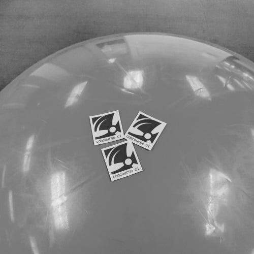

/// caption
The Concourse team’s big yoga ball has returned to its rightful home
///

<!-- more -->

As a part of our refactor of the prod pipeline, [Alex Suraci](https://medium.com/u/263a63b2f209) cleaned up and
refactored parts of the TSA to better support draining and
rebalancing [#2748](https://github.com/concourse/concourse/pull/2748). The numbers are looking really good!

On to the update:

## API

- We’re deep into investigations around our API documentation and management strategy. Our current investigation work is
  captured in [#2739](https://github.com/concourse/concourse/issues/2739) but the original request comes
  from [#1122](https://github.com/concourse/concourse/issues/1122)

## Core

- SPACCEEEE [#2651](https://github.com/concourse/concourse/pull/2651)

## UX

- Continuing our work on supporting pinning of versions on resources from the UI. You can see some of our progress
  on [#2508](https://github.com/concourse/concourse/pull/2508)

## Runtime

- Continuing our work on [#2676](https://github.com/concourse/concourse/pull/2676)
  and [#1266](https://github.com/concourse/concourse/pull/1266)

## Operations

- Adding jobs to our pipeline to better support the Concourse Helm
  Chart [#2743](https://github.com/concourse/concourse/pull/2743)
- And in general [Topher Bullock](https://medium.com/u/58876cdc2180) has been helping out with PRs and issues on the
  Concourse Helm Chart.
