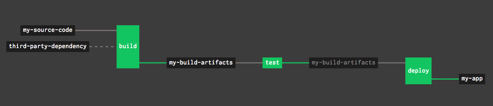
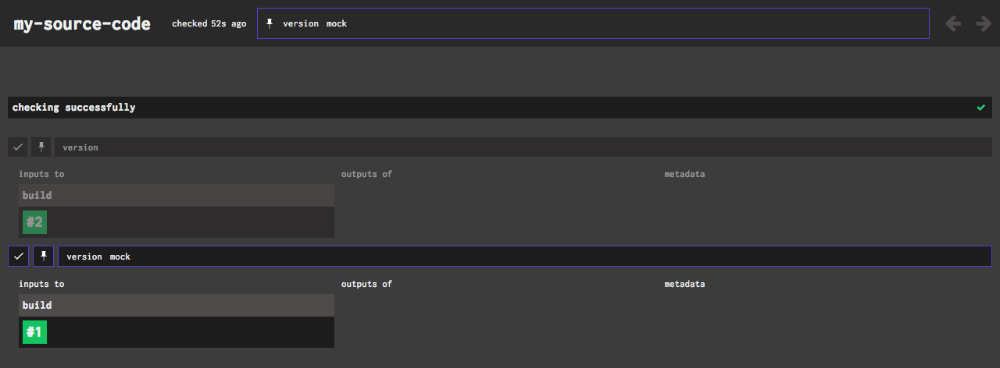

The purpose of this document is to introduce and justify the existence of the resource page in its current incarnation,
and to preview some upcoming changes to the page.

<!-- more -->

## Why does this page exist? What does it do right now?


/// caption
Concourse Resource Page for credhub-release resource in prod pipeline — currently employing the “disable everything and
pause” kludge described below
///

1. Surface the resource check status and age — show check errors, if any.
2. Radiate information about a resource’s versions — at a glance, you can see the list of versions (that have been found
   by checking) in reverse chronological order. For example, you can see the equivalent of running `git log` on a git
   resource to understand which commits your Concourse instance has discovered.
3. Get version metadata — sometimes the individual versions are not especially expressive; the git resource is a great
   example of this. Only seeing the commit hash doesn’t make it very easy for a human to identify the commit, but when
   you expand a version that has been retrieved via a `get` step in a job, you can see the commit time, author, and
   message, so you don’t need to cross reference against GitHub or your local `git log` output to figure out what is
   going on.
4. Get inputs to/outputs of — this provides another means of visualizing how this resource interacts with your jobs, and
   a jumping off point to go to specific builds for those jobs — if all the builds for a given version are red, maybe
   it’s because there is some breaking change in that version?
5. Pause checking—this button was introduced with use cases like the scenario below in mind. When an upstream dependency
   introduces a breaking change, you may want to stop using new versions until you bring your code back into
   compatibility.
6. Enable/disable versions — this feature was created with the “Bad Version” scenario (to be described in another story)
   in mind.

## The “Pinned Version” Scenario

In the following scenario, let’s assume we are a development team delivering software via a a so-called “three-box”
continuous delivery pipeline like this (some fine details intentionally left out):

```yaml
resources:
  - name: third-party-dependency
    type: gcs
  - name: my-source-code
    type: git
  - name: my-build-artifacts
    type: gcs
  - name: my-app
    type: cf

jobs:
  - name: build
    plan:
    — get: my-source-code
      trigger: true
    — get: third-party-dependency
    — task: build
    — put: my-build-artifacts
  - name: test
    plan:
    — get: my-build-artifacts
      trigger: true
    — task: test
  - name: deploy
    plan:
    — get: my-build-artifacts
      trigger: true
      passed:
        - test
    — put: my-app
```


/// caption
Rendered view of the delivery pipeline in question
///

Suppose that the authors of `third-party-dependency` release a new major version that breaks compatibility with
`my-source-code` in a way that we’re not ready to adapt to yet because we have more pressing issues in our backlog.

That version might be perfect and bug-free in and of itself, but it causes the `test` job to fail. However, we’ve still
got features to deliver — we’d like to just pin `third-party-dependency` at the last known working version so that we’re
not prevented from deploying (by the `passed:` constraint on the `get` step in our `deploy` job) for the time being, and
we’ll pay down the technical debt of bringing our dependency back up to date later.

Now, strictly speaking, Concourse does provide an official solution to this problem: you can define a resource in the
pipeline config so that only one [version][resources] will ever be used. In our case, we could change the definition of
`third-party-dependency` to be something like

```yaml
- name: third-party-dependency
  type: gcs
  version:
    path: third-party-dependency-v1.1.0.tgz
```

## The “Disable Everything and Pause” Kludge

The official solution for the “pinned version” scenario isn’t perfect. Clever users,
like [krishicks](https://github.com/concourse/concourse/issues/1288) on GitHub, noticed that often your desire to pin a
dependency is really just temporary. Furthermore it is possible that not all of your development team has an account on
your Concourse instance such that they can reset the pipeline themselves, and you may unwittingly block them from doing
their work this way. This struck the Concourse team as a valid concern and something that the product should support.

Furthermore, such clever users discovered an undocumented workflow for pinning the version of a resource without
modifying their pipeline config:

1. Visit the resource page and click the pause button to suspend checking.
2. Disable all versions that were discovered after the one you wish to pin. Since jobs will use the latest available
   version that passes their constraints in `get` steps, then you have effectively pinned your resource to the desired
   version.

Now, if there have been many versions discovered since the breaking change occurred, this solution can require a lot of
clicks. If your project has a lot of dependencies (e.g., you are developing Cloud Foundry!) then you may find yourself
performing this onerous, many-click operation frequently. This is painful, and so the Concourse team wants to make it
better.

## First-Class Dynamic Version Pinning


/// caption
Current state of the new pin functionality — to be included in the next major release
///

The Concourse team decided to add a pin icon to each version of the resource so that instead of performing all those
clicks you can do just one — click the pin and then all other versions of the resource will be disabled (including new
ones that are freshly discovered via checking). The road to this decision is documented
in [this GitHub issue](https://github.com/concourse/concourse/issues/2508).

[resources]: ../../../../docs/resources/index.md