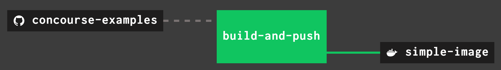

In this blog post we are going to show how to build and publish container images using
the [oci-build task][oci]
and [registry-image resource](https://github.com/concourse/registry-image-resource). This post assumes you understand
how to build container images with `Dockerfile`'s and publish to [Docker Hub](https://hub.docker.com/) or another image
registry using the [`docker` cli](https://docs.docker.com/engine/reference/commandline/cli/).

<!-- more -->

_If you just want to see the pipeline, scroll to the bottom
or [click here](https://github.com/concourse/examples/blob/master/pipelines/build-and-push-simple-image.yml). What
follows is a detailed explanation of what each part of the pipeline does._

First we need a Dockerfile. You can store this in your own repo or reference
the [github.com/concourse/examples](https://github.com/concourse/examples) repo. The rest of this post assumes you use
the [examples](https://github.com/concourse/examples) repo. All files in this blog post can be found in the examples
repo.

## The Dockerfile

We are going to use a very
basic [Dockerfile](https://github.com/concourse/examples/blob/master/Dockerfiles/simple/Dockerfile) so we can focus on
building the Concourse pipeline.

```dockerfile
FROM busybox

RUN echo "I'm simple!"
COPY ./stranger /stranger
RUN cat /stranger
```

## Defining Pipeline Resources

Now we can start building out our pipeline. Let's declare our [resources](../../../../docs/resources/index.md)
first. We will need one resource to pull in the repo where our Dockerfile is located, and a second resource pointing to
where we want to push the built container image to.

_There are some [variables](../../../../examples/pipeline-vars.md#variables) in this file that we will
fill out later._

```yaml
resources:
  # The repo with our Dockerfile
  - name: concourse-examples
    type: git
    icon: github
    source:
      uri: https://github.com/concourse/examples.git
      branch: master

  # Where we will push the image to
  - name: simple-image
    type: registry-image
    icon: docker
    source:
      repository: ((image-repo-name))/simple-image
      username: ((registry-username))
      password: ((registry-password))
```

## Create a Job

Next we will create a [job][job] that will build and push our container image.

```yaml
jobs:
  - name: build-and-push
```

### Retrieve the Dockerfile

The first [step][step] in the [job plan][job] will be to retrieve the repo where our Dockerfile is.

```yaml
jobs:
  - name: build-and-push
    plan:
      - get: concourse-examples
```

### Build the Container Image

The second step in our job will build the container image.

To build the container image we are going to use the [oci-build-task][oci]. The [oci-build-task][oci] is a container
image that is meant to be used in a Concourse [task][task] to build other container images. Check out the [
`README`][oci_readme] in the repo for more details on how to
configure and use the [oci-build-task][oci] in more complex build scenarios.

Let's add a [task][task] to our [job plan][job] and give it a name.

```yaml
jobs:
  - name: build-and-push
    plan:
      - get: concourse-examples
      - task: build-task-image
```

All configuration of the `oci-build-task` is done through a [task config][task]. Viewing
the [`README`][oci_readme] from the repo we can see that the task
needs to be run as a [privileged task][task_step] on a linux
worker.

```yaml
jobs:
  - name: build-and-push
    plan:
      - get: concourse-examples
      - task: build-task-image
        privileged: true
        config:
          platform: linux
```

To use the `oci-build-task` container image we specify the [`image_resource`][task] that the task should use.

```yaml
jobs:
  - name: build-and-push
    plan:
      - get: concourse-examples
      - task: build-task-image
        privileged: true
        config:
          platform: linux
          image_resource:
            type: registry-image
            source:
              repository: vito/oci-build-task
```

Next we will add [`concourse-examples`](https://github.com/concourse/examples) as an [input][task] to the build task to
ensure the artifact from the [get step][get] (where our `Dockerfile` is fetched) is mounted in our`build-task-image`
step.

```yaml
jobs:
  - name: build-and-push
    plan:
      - get: concourse-examples
      - task: build-task-image
        privileged: true
        config:
          platform: linux
          image_resource:
            type: registry-image
            source:
              repository: vito/oci-build-task
          inputs:
            - name: concourse-examples
```

The `oci-build-task` [outputs the built container image](https://github.com/concourse/oci-build-task#outputs) in a
directory called `image`. Let's add `image` as an output artifact of our task so we can publish it in a later step.

```yaml
jobs:
  - name: build-and-push
    plan:
      - get: concourse-examples
      - task: build-task-image
        privileged: true
        config:
          platform: linux
          image_resource:
            type: registry-image
            source:
              repository: vito/oci-build-task
          inputs:
            - name: concourse-examples
          outputs:
            - name: image
```

Next we need to tell the `oci-build-task` what
the [build context](https://docs.docker.com/engine/reference/commandline/build/) of our Dockerfile is. The [
`README`][oci] goes over a few other methods of creating your build context. We are
going to use the simplest use-case. By specifying `CONTEXT` the `oci-build-task` assumes a `Dockerfile` and its build
context are in the same directory.

```yaml
jobs:
  - name: build-and-push
    plan:
      - get: concourse-examples
      - task: build-task-image
        privileged: true
        config:
          platform: linux
          image_resource:
            type: registry-image
            source:
              repository: vito/oci-build-task
          inputs:
            - name: concourse-examples
          outputs:
            - name: image
          params:
            CONTEXT: concourse-examples/Dockerfiles/simple
```

The last step is specifying what our `build-task-image` should execute. The `oci-build-task` container image has a
binary named [
`build`](https://github.com/concourse/oci-build-task/blob/230df3baa27fb389484ee0fb74355cd8b7977298/Dockerfile#L11)
located in its `PATH` in the [
`/usr/bin` directory](https://github.com/concourse/oci-build-task/blob/230df3baa27fb389484ee0fb74355cd8b7977298/Dockerfile#L15).
We'll tell our task to execute that binary, which will build our container image.

```yaml
jobs:
  - name: build-and-push
    plan:
      - get: concourse-examples
      - task: build-task-image
        privileged: true
        config:
          platform: linux
          image_resource:
            type: registry-image
            source:
              repository: vito/oci-build-task
          inputs:
            - name: concourse-examples
          outputs:
            - name: image
          run:
            path: build
          params:
            CONTEXT: concourse-examples/Dockerfiles/simple
```

At this point in our job the container image is built! The `oci-build-task` has saved the container image as a tarball
named `image.tar` in the `image` artifact specified in the task outputs. This tar file is the same output you would get
if you built the container image using Docker and then did [
`docker save`](https://docs.docker.com/engine/reference/commandline/save/).

## Publish the Container Image

Now let's push the container image to an image registry! For this example we're pushing
to [Docker Hub](https://hub.docker.com/) using the [
`registry-image` resource](https://github.com/concourse/registry-image-resource). You can use the `registry-image`
resource to push to any image registry, private or public. Check out the [
`README.md`](https://github.com/concourse/registry-image-resource/blob/master/README.md) for more details on using the
resource.

To push the container image add a [put step][put] to our job plan and tell the
registry-image resource where the tarball of the container image is.

The put step will push the container image using the information defined in the
resource's [source](../../../../docs/resources/index.md), when we defined
the [pipeline's resources](../../../../docs/pipelines/index.md#pipeline-schema).

This is where you'll need to replace the three [variables](../../../../docs/vars.md) found under
`resource_types`. You can define them [statically](../../../../docs/vars.md#static-vars) using `fly`'s `--var`
flag when [setting](../../../../docs/pipelines/setting-pipelines.md) the pipeline. _(In production make sure to use
a [credential management system](../../../../docs/operation/creds/index.md) to store your secrets!)_

```yaml
jobs:
  - name: build-and-push
    plan:
      - get: concourse-examples
      - task: build-task-image
        privileged: true
        config:
          platform: linux
          image_resource:
            type: registry-image
            source:
              repository: vito/oci-build-task
          inputs:
            - name: concourse-examples
          outputs:
            - name: image
          params:
            CONTEXT: concourse-examples/Dockerfiles/simple
          run:
            path: build
      - put: simple-image
        params:
          image: image/image.tar
```

## The Entire Pipeline

Putting all the pieces together, here is our pipeline that builds and pushes (publishes) a container image.

```yaml
resources:
  # The repo with our Dockerfile
  - name: concourse-examples
    type: git
    icon: github
    source:
      uri: https://github.com/concourse/examples.git
      branch: master

  # Where we will push the image
  - name: simple-image
    type: registry-image
    icon: docker
    source:
      repository: ((image-repo-name))/simple-image
      username: ((registry-username))
      password: ((registry-password))

jobs:
  - name: build-and-push
    plan:
      - get: concourse-examples
      - task: build-task-image
        privileged: true
        config:
          platform: linux
          image_resource:
            type: registry-image
            source:
              repository: vito/oci-build-task
          inputs:
            - name: concourse-examples
          outputs:
            - name: image
          params:
            CONTEXT: concourse-examples/Dockerfiles/simple
          run:
            path: build
      - put: simple-image
        params:
          image: image/image.tar
```

You can set the pipeline with the following `fly` command, updating the variable values with real values the pipeline
can use. The behaviour is similar to [`docker push`](https://docs.docker.com/engine/reference/commandline/push/):

```shell
fly -t <target> set-pipeline -p build-and-push-image \
    -c ./examples/pipelines/build-and-push-simple-image.yml \
    --var image-repo-name=<repo-name> \
    --var registry-username=<user> \
    --var registry-password=<password>
```


/// caption
Build and Push Pipeline
///

## Further Readings

Understanding what the _build context_ is important when building container images. You can
read [Dockerfile Best Practices](https://docs.docker.com/develop/develop-images/dockerfile_best-practices/#understand-build-context)
for more details about _build contexts_.

The [inputs](https://github.com/concourse/oci-build-task#inputs) section of the oci-build-task's `README` has examples
on how to create a build context with multiple inputs and other complex build scenarios.

Read the `README`'s in the [oci-build-task][oci]
and [registry-image resource](https://github.com/concourse/registry-image-resource/) to learn more about their other
configuration options.

If you had trouble following how the artifacts get passed between the steps of a job then read our other blog post
about [task inputs and outputs](../05/2020-05-25-introduction-to-task-inputs-and-outputs.md).

[job]: ../../../../docs/jobs.md

[step]: ../../../../docs/steps/index.md

[get]: ../../../../docs/steps/get.md

[put]: ../../../../docs/steps/put.md

[task]: ../../../../docs/tasks.md

[task_step]: ../../../../docs/steps/task.md

[oci]: https://github.com/concourse/oci-build-task

[oci_readme]: https://github.com/concourse/oci-build-task/blob/master/README.md