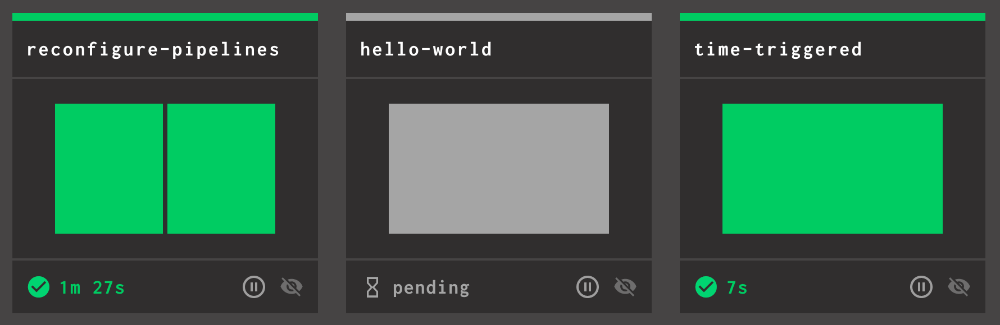

In this blog post we're going to cover how to use git and Concourse to automatically set, update, and archive your
pipelines using the `set_pipeline` step. No longer will you need to use `fly set-pipeline` to update any of your
pipelines!

<!-- more -->

For consistency, we will refer to the pipeline that contains all the `set_pipeline` steps as the **parent pipeline**.
The pipelines created by the `set_pipeline` steps will be called **child pipelines**.

_Scroll to the bottom to see the final pipeline template
or [click here](https://github.com/concourse/examples/blob/master/pipelines/set-pipelines.yml). What follows is a
detailed explanation of how the parent pipeline works along with git and automatic archiving._

## Prerequisites

To run the pipelines in this blog post for yourself you can get your own Concourse running locally by following
the [Quick Start guide](../../../../docs/getting-started/quick-start.md).

You will also need to fork the [github.com/concourse/examples](https://github.com/concourse/examples) repo and replace
`USERNAME` with your GitHub username in the below examples. We will continue to refer to the repo as
`concourse/examples`. Once you have forked the repo clone it locally onto your machine and `cd` into the repo.

```shell
git clone git@github.com:USERNAME/examples.git
cd examples
```

## Create the Parent Pipeline

Inside your fork of `concourse/examples` that you have cloned locally, create a file named `reconfigure-pipelines.yml`
inside the `pipelines` folder. This is the pipeline that we are going to be building. We will refer to this pipeline as
the _parent pipeline_.

```shell
touch ./pipelines/reconfigure-pipelines.yml
```

Like the `fly set-pipeline` command, the `set_pipeline` step needs a YAML file containing a pipeline configuration. We
will use the concourse/examples repo as the place to store our pipelines, and thankfully it already contains many
pipelines! Let's add the repo as a resource to our parent pipeline.

```yaml
resources:
  - name: concourse-examples
    type: git
    icon: github
    source:
      uri: git@github.com:USERNAME/examples.git
```

Now we will add a job that will set our pipelines. The first step in the job will fetch the `concourse/examples` repo,
making it available to future steps as the `concourse-examples` artifact. We will also add the `trigger` parameter to
ensure that the job will run whenever a new commit is pushed to the `concourse/examples` repo.

```yaml
resources:
  - name: concourse-examples
    type: git
    icon: github
    source:
      uri: git@github.com:USERNAME/examples.git

jobs:
  - name: configure-pipelines
    public: true
    plan:
      - get: concourse-examples
        trigger: true
```

Next we will add the `set_pipeline` step to set one of the pipelines in the `concourse/examples` repo. We will set the
`hello-world` pipeline first.

```yaml
resources:
  - name: concourse-examples
    type: git
    icon: github
    source:
      uri: git@github.com:USERNAME/examples.git

jobs:
  - name: configure-pipelines
    public: true
    plan:
      - get: concourse-examples
        trigger: true
      - set_pipeline: hello-world
        file: concourse-examples/pipelines/hello-world.yml
```

Let's commit what we have so far and push it to GitHub.

```shell
$ git add pipelines/reconfigure-pipelines.yml
$ git commit -m "add reconfigure-pipelines"
$ git push -u origin head
```

## Setting the Parent Pipeline

Now we have a [chicken or the egg](https://en.wikipedia.org/wiki/Chicken_or_the_egg) problem, except in this case we
know our parent pipeline comes first! Let's set our pipeline with `fly` and execute the `configure-pipelines` job.

```console
$ fly -t local set-pipeline \
  -p reconfigure-pipelines \
  -c pipelines/reconfigure-pipelines.yaml

...
apply configuration? [yN]: y

$ fly -t local unpause-pipeline \
  -p reconfigure-pipelines
  
unpaused 'reconfigure-pipelines'

$ fly -t local trigger-job \
  -j reconfigure-pipelines/configure-pipelines \
  --watch
```

Once the job is done running you should see two pipelines, `reconfigure-pipelines` and `hello-world`.


/// caption
Concourse dashboard showing two pipelines
///

Now any changes you make to the `hello-world` pipeline will be updated automatically in Concourse once it picks up the
commit with your changes.

## Pipelines Setting Themselves

Our parent pipeline is setting and updating one other pipeline now, but it has one glaring limitation: it doesn't set
itself. We have to `fly set-pipeline` every time we want to add a new pipeline to the `configure-pipelines` job.

To resolve this we can do the following to our parent pipeline:

- Add a job **before** the `configure-pipelines` job that self-updates the parent pipeline. We'll name the job
  `configure-self`.
- Add a `passed` constraint to the `configure-pipelines` job to only run once the `concourse-examples` resource has
  passed the new `configure-self` job.

By doing the above we will never have to use `fly` to update the parent pipline again. Every commit to the
`concourse/examples` repo will cause the parent pipeline to update itself and then all of its child pipelines. Now our
pipelines are following a GitOps type of workflow!

Here is what the above changes look like when implemented:

```yaml
resources:
  - name: concourse-examples
    type: git
    icon: github
    source:
      uri: git@github.com:USERNAME/examples.git

jobs:
  - name: configure-self
    plan:
      - get: concourse-examples
        trigger: true
      - set_pipeline: reconfigure-pipelines
        file: concourse-examples/pipelines/reconfigure-pipelines.yml
  - name: configure-pipelines
    plan:
      - get: concourse-examples
        trigger: true
        passed: [ configure-self ]
      - set_pipeline: hello-world
        file: concourse-examples/pipelines/hello-world.yml
```

**Side-note** : for the `configure-self` job, you could also use the [
`self` keyword](../../../../docs/steps/set-pipeline.md), though this is labelled as experimental and may disappear in
the future.

Let's set the parent pipeline one more time with `fly` and then we'll make commits to the repo to make all future
changes.

```console
$ fly -t local set-pipeline \
  -p reconfigure-pipelines \
  -c pipelines/reconfigure-pipelines.yaml
  
...
apply configuration? [yN]: y
```

The parent pipeline should now look like this. Now the pipeline will first update itself and then update any existing
child pipelines.


/// caption
parent pipeline with config-self job
///

Let's commit our changes, which will be a no-op since we've already updated the pipeline with the latest changes.

```console
$ git add pipelines/reconfigure-pipelines.yml
$ git commit -m "add configure-self job"
$ git push
```

Now comes the real fun! To add a pipeline to Concourse all we need to do is add a `set_pipeline` step to the parent
pipeline, commit it to the `concourse/examples` repo, and let the parent pipeline pick up the new commit and make the
changes for us.

Let's add the `time-triggered` pipeline to our `reconfigure-pipelines.yml` file.

```yaml
resources:
  - name: concourse-examples
    type: git
    icon: github
    source:
      uri: git@github.com:USERNAME/examples.git

jobs:
  - name: configure-self
    plan:
      - get: concourse-examples
        trigger: true
      - set_pipeline: reconfigure-pipelines
        file: concourse-examples/pipelines/reconfigure-pipelines.yml
  - name: configure-pipelines
    plan:
      - get: concourse-examples
        trigger: true
        passed: [ configure-self ]
      - set_pipeline: hello-world
        file: concourse-examples/pipelines/hello-world.yml
      - set_pipeline: time-triggered
        file: concourse-examples/pipelines/time-triggered.yml
```

Commit and push the changes to GitHub.

```console
$ git add pipelines/reconfigure-pipelines.yml
$ git commit -m "add time-triggered pipeline"
$ git push
```

Once Concourse picks up the commit (may take up to a minute by default) you should see three pipelines on the dashboard.
Now you never need to use `fly` to set pipelines!


/// caption
parent and child pipelines
///

## Detour: A Future Alternative of Setting Pipelines

In the future there will be a different solution to setting parent pipelines: no more parent pipelines! How will
Concourse eliminate the current need to start with a parent pipeline in order to set child pipelines? The answer
is [RFC 32: Projects](https://github.com/concourse/rfcs/pull/32/).

If [RFC 32](https://github.com/concourse/rfcs/pull/32/) is implemented as currently described then you won't have to
ever use `fly set-pipeline` to create pipelines, you'll simply create a **Project** , which involves pointing Concourse
to a repo where you code lives. In the proposed `project.yml` you can then define all of your child pipelines with
`set_pipeline` steps. No need to create a parent pipeline; the `project.yml` replaces the parent pipeline and no longer
requires you to have a separate job that does `set_pipeline: self`.

The [RFC is still open](https://github.com/concourse/rfcs/pull/32) and looking for feedback. Check out the PR and leave
your thoughts for the community to discuss!

Now let's get back on track and talk about the last step in a pipeline's lifecycle: archiving.

## Automatically Archiving Pipelines

Having Concourse automatically set pipelines for you is great but that only covers half of the lifecycle that a pipeline
can go through. Some pipelines stay around forever and get continuously updated. Other pipelines may only be around for
a small amount of time and then be deleted or archived.

Thanks to [RFC #33](https://github.com/concourse/rfcs/pull/33) you can now archive pipelines and have Concourse *
*automatically archive** pipelines for you as well. You've been able to archive pipelines using `fly` since Concourse
6.1.0. Automatic archiving was added in 6.5.0.

A pipeline will only be considered for automatic archiving if it was previously set by a `set_pipeline` step. It will be
archived if one of the following is true:

- the `set_pipeline` step is removed from the job
- the job that was setting the child pipeline is deleted
- the parent pipeline is deleted or archived

We can test this out with the parent pipeline we were just using. Let's remove the `hello-world` pipeline.

```yaml
resources:
  - name: concourse-examples
    type: git
    icon: github
    source:
      uri: git@github.com:USERNAME/examples.git

jobs:
  - name: configure-self
    plan:
      - get: concourse-examples
        trigger: true
      - set_pipeline: reconfigure-pipelines
        file: concourse-examples/pipelines/reconfigure-pipelines.yml
  - name: configure-pipelines
    plan:
      - get: concourse-examples
        trigger: true
        passed: [ configure-self ]
      - set_pipeline: time-triggered
        file: concourse-examples/pipelines/time-triggered.yml
```

Commit and push the changes to GitHub.

```shell-session
$ git add pipelines/reconfigure-pipelines.yml
$ git commit -m "remove hello-world pipeline"
$ git push
```

After a few seconds the pipeline should disappear from the dashboard (unless you toggle "show archived" on).

With automatic archiving the entire lifecycle of your pipelines can now be managed with a git repo and a few commits.

I suggest checking out the documentation for [`set_pipeline`](../../../../docs/steps/set-pipeline.md) to see all the
other fields available for the step, like `team` and `vars`!

## The Parent Pipeline Template (tl;dr)

```yaml
resources:
  - name: ci
    type: git
    icon: github
    source:
      uri: git@github.com:USERNAME/repo-where-pipelines-live.git

jobs:
  - name: configure-self
    plan:
      - get: ci
        trigger: true
      - set_pipeline: self
        file: ci/path/to/parent-pipeline.yml
  - name: configure-pipelines
    plan:
      - get: ci
        trigger: true
        passed: [ configure-self ]
      - set_pipeline: some-pipeline
        file: ci/path/to/some-pipeline.yml
      - set_pipeline: another-pipeline
        file: ci/path/to/another-pipeline.yml
```
