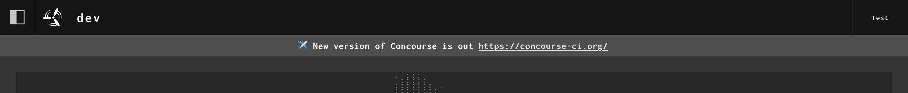
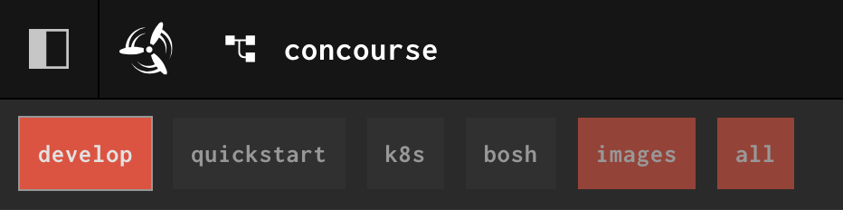

[v8.0.0](https://github.com/concourse/concourse/releases/tag/v8.0.0) of
Concourse is out! I'm going to explain why a new major was needed and flag
anything that pipeline writers and Concourse operators should keep an eye out
for.

<!-- more -->

## ✨ New Website

First, huge thanks to [kcbimonte](https://github.com/kcbimonte) for doing the
tedious work of migrating the website off of [booklit](https://booklit.page/)
and onto MkDocs. We will eventually move it all over to
[Zensical](https://zensical.org/) once they have all the features we need.

My hope with the new site is that it's easier for users to contribute to the
docs now. Booklit had its pros, particularly with how internal links were
handled, but it was definitely a bit of a challenge to extend and change. It
was also quite a hurdle for new users to understand.

Now, onto the new release!

## Why a New Major Version?

As a project, Concourse avoids making actually breaking changes. For example, a
pipeline from v4 of Concourse should still continue to work on v8 of Concourse.
That said, we have made major version bumps over the years, but they're usually
not for "breaking changes" in the traditional sense.

With Concourse, major version bumps have been motivated by large/long-running
database migrations. Those were the reasons behind the v5, v6, and v7 major
bumps. That was also the initial reason for this new major, kicked off by [PR #9165](https://github.com/concourse/concourse/pull/9165).

[#9165](https://github.com/concourse/concourse/pull/9165) changes how Concourse
stores resource versions, using SHA256 instead of MD5 to create and store
digests. This helps operators running Concourse in secure environments, where
algorithms like MD5 are not allowed.

The migration from this PR alone will take a few minutes to run. I recommend
scaling down your web nodes to one node and then upgrading that single node.
I've tested running this migration on
[ci.concourse-ci.org](https://ci.concourse-ci.org) and it took ~5 minutes on a
Postgresql instance with 4 vCPU and 5GB of RAM. We have `4,358,045` records in
our `resource_config_versions` table, which is the main table modified in
the migration. You can run the following query against your Concourse database
to check how many records your table has:

```sql
SELECT COUNT(*) FROM resource_config_versions;
```

This is very much a "behind the scenes" change, as users shouldn't see anything
different happening with regards to how their pipelines behave. This change
future-proofs Concourse and enables Concourse to continue running in secure
environments around the world.

Not wanting to let a good major go to waste, I decided to also tackle a lot of
outstanding chore issues to improve and refresh Concourse a bit. Let's go over
all the big changes that landed in v8. Full release notes can be found on
Github:
[https://github.com/concourse/concourse/releases/tag/v8.0.0](https://github.com/concourse/concourse/releases/tag/v8.0.0)

## 🛠️ Changing Defaults


### 📦 Container Runtime

We've changed the default container runtime to `containerd`! Guardian is still
a supported runtime but is no longer the default. The main motivation for this
change was the issues we'd see from users trying to run Guardian on newer
kernel versions, specifically systems only using cgroups v2. `containerd` has
proven very stable for us and many users in the community.

### 🔒 Secret Redaction

Secret redaction is now always enabled and its corresponding feature flag has
no effect. This feature was initially feature flagged to monitor for any
performance issues. We have seen none over the many years that this feature has
been available. We consider this feature safe to use in all production environments.

### 🔀 Instance Pipelines and `across` Step

Instance pipelines and `across` steps are now always enabled, and their feature
flags have no effect. Their "experimental" labels and warnings have also been
removed. Both features have been available for years now and I see no reason to
change their current behaviour. Users can consider these features stable.

### ➡️ Inputs for `put` Steps

The default value for `put.inputs` is changed from `all` to `detect`. Streaming
all volumes into a `put` step has always been overkill and results in long
initialization times for `put` steps. `detect` works by reviewing all values in
`put.params` and only mounting volumes with matching names.

This is a breaking change if you have a custom resource type that has
hard-coded the expected names of volumes into your scripts. I haven't seen any
resources like this personally, but if they do exist, simply set
[`put.inputs`](../../../../docs/steps/put.md) to `all` or an array of the
volumes to mount in your put step.

## ✈️ New Features and Enhancements

It wouldn't be a major release without a couple new features and enhancements.

### 📢 Broadcast Message System

Operators can now broadcast messages to their Concourse cluster and it will
appear as a banner in the Concourse web UI. Thank you to
[ceco556](https://github.com/ceco556) for finishing the implementation.

There are three `fly` commands used to manage this system:

* `fly set-wall`
    * Can only be used by users of the `main` team
* `fly get-wall`
    * Can be used by all users
* `fly clear-wall`
    * Can only be used by users of the `main` team

!!! tip "Fun Fact!"
    "Wall" is a reference to the [Unix `wall`](https://en.wikipedia.org/wiki/Wall_(Unix)) CLI.

When setting the message with `fly set-wall`, you can include emojis and links.
Links will be parsed and turned into HTML links that users can click. We made
sure that no XSS vulnerabilities were introduced.


/// caption
Concourse dashboard showing a broadcast message
///

### 🏷️ Build URLs for Step Metadata

There are two new handy env vars made available to `get` and `put` steps:

* `BUILD_URL` - Same URL as what you see in the web UI that includes team, pipeline, and job name
* `BUILD_URL_SHORT` - Shorter URL that uses the build's internal ID instead of the pipeline scoped ID

See [the docs](../../../../docs/resource-types/implementing.md#metadata) for more details.

### 👥 Team Name in `set_pipeline` Steps

Users of the `main` team have been able to set pipelines for other teams for
quite a while now. In the web UI though, it wasn't obvious that a pipeline was
being set for another team. The team name is now displayed when setting a
pipeline for another team.


/// caption
Concourse build logs show `set_pipeline` steps with the team name
///

### 🚥 Highlighted Group Tabs

To make finding failed builds even easier, especially on large pipelines with
lots of jobs and groups, group tabs will be highlighted red/orange.


/// caption
Concourse group tabs highlighted red
///

Thank you to [analytically](https://github.com/analytically) for these last
three enhancements! He's made many other useful contributions this
release that you can find in the release notes.

### ▶️ Tasks Can Use `ENTRYPOINT`/`CMD`

If you don't define a `run.path` in your Task's config, Concourse will now
fall back to running the `ENTRYPOINT`/`CMD` defined in the container image. If
you define any `run.args` in your Task's config, those will be appended to the
`ENTRYPOINT`/`CMD` from the container. This is the same behaviour you get with
`[docker/podman] run` today.

To be clear, Concourse still uses its custom rootfs format behind-the-scenes.
I assume the majority of users use the
[registry-image](https://github.com/concourse/registry-image-resource) to pull
in their images in rootfs format and can therefore leverage this feature. If
you have some tooling that creates its own rootfs formatted images, you can
review [this PR](https://github.com/concourse/registry-image-resource/pull/394)
for how to pass that info along to Concourse.

## 2026 and Support

Thank you to everyone who contributed to this new release. There are already
more PRs open that will land in v8.1.0 in a few months. Moving forward, I'm
planning to make new minor releases approximately every quarter. Patches will
be released for any critical bugs and security fixes as needed. My main focus
will be on continuing to make Concourse more robust and stable.

I am still looking for more commercial users of Concourse that are interested
in supporting the project. If your company uses Concourse and is interested in
seeing the continued development and maintenance of the project, please [reach
out to me](https://pixelair.io/contact/). You get direct access to me to
address any Concourse issues you have, as well as training on Concourse
best practices.

Thank you to all the individuals and the organization
([SAP💙](https://github.com/SAP)) that support me over on
[GitHub](https://github.com/sponsors/taylorsilva) as well. They, along with my
commercial customers, have made this first year of Concourse development
possible! ✈️
