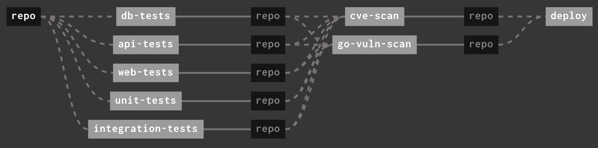
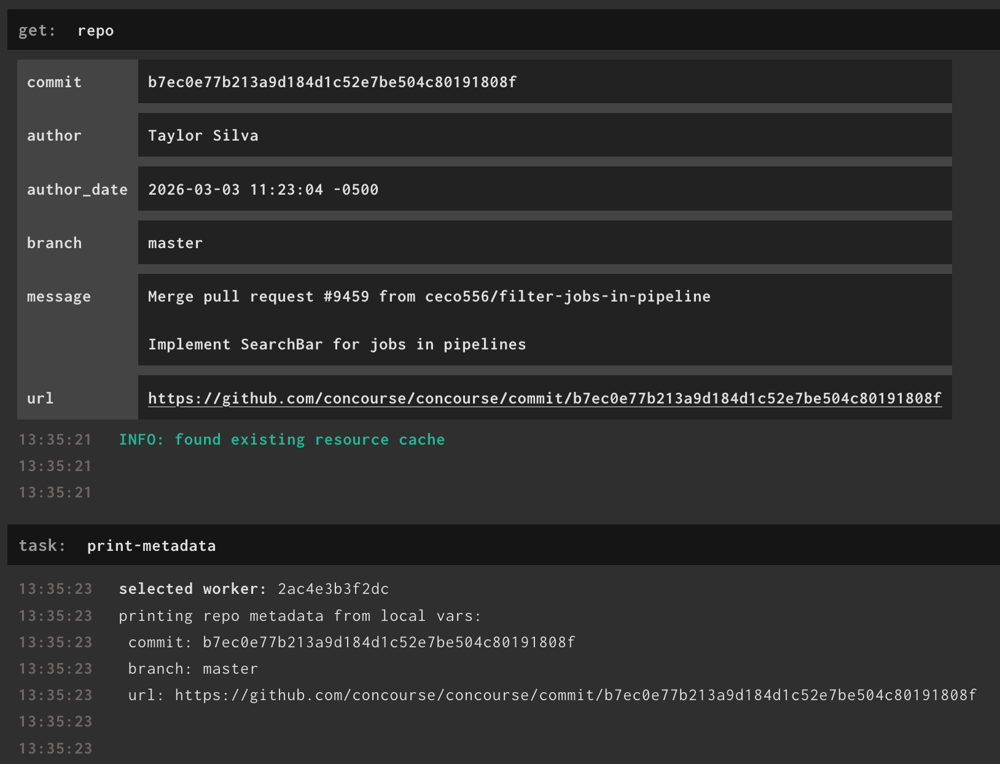
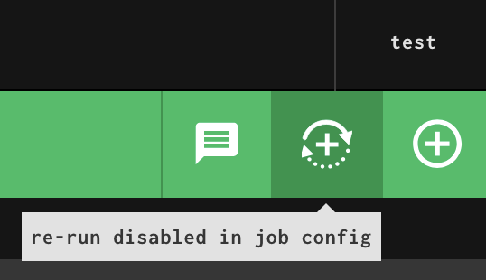

[v8.1.0](https://github.com/concourse/concourse/releases/tag/v8.1.0) is out,
earlier than expected. I initially planned for a release closer to the end of
March, but found we had a lot of unreleased code after only two months. In the
spirit of being [Agile ](https://agilemanifesto.org/principles.html), it felt
right to get this release out sooner rather than later.

Let's go over some of the new features and how to use them. Check the [release
notes](https://github.com/concourse/concourse/releases/tag/v8.1.0) for all the
new features and bug fixes.

<!-- more -->

## 🔎 Search Bar for your Jobs

Added in [PR 9459](https://github.com/concourse/concourse/pull/9459) by
[@ceco556](https://github.com/ceco556).

This PR adds a search bar to the pipeline overview page that allows users to
fuzzy search for jobs. The pipeline overview filters for any matching jobs,
allowing users with large pipelines to quickly filter down to the job they're
looking for. You can also filter by the status of the job (paused, failed,
running, etc.). If your pipeline has groups, the filter will apply to the
currently selected group(s).

<video controls>
<source src="/blog/2026/03/assets/job-search-bar.mp4" type="video/mp4">
</video>
/// caption
Video demonstrating the search bar for job filtering within a pipeline.
///

## *️⃣ Glob Patterns for Passed Constraints

Added in [PR 9418](https://github.com/concourse/concourse/pull/9418) by
[@kcbimonte](https://github.com/kcbimonte).

You can now specify a shell glob pattern for [passed
constraints](../../../../docs/steps/get.md#passed) in your `get` steps. The
pattern is evaluated by Go's [`path.Match()`](https://pkg.go.dev/path#Match).

If you have a long list of passed constraints with jobs that have similar
names, you can now replace them with a simple glob pattern. This is also useful
for users doing complex pipeline templating where jobs may or may not be
present depending on how your pipeline is rendered.

Here's an example pipeline showcasing how to use this new feature.

```yaml
resources:
  - name: repo
    type: mock

jobs:
  - name: unit-tests
    plan:
      - get: repo

  - name: web-tests
    plan:
      - get: repo

  - name: db-tests
    plan:
      - get: repo

  - name: integration-tests
    plan:
      - get: repo

  - name: api-tests
    plan:
      - get: repo

  - name: cve-scan
    plan:
      - get: repo
        passed:
          - "*-tests" #Glob pattern!

  - name: go-vuln-scan
    plan:
      - get: repo
        passed:
          - "*-tests" #Glob pattern!

  - name: deploy
    plan:
      - get: repo
        passed:
          - "*-scan" #Glob pattern!
```

The pipeline still renders as expected.


/// caption
Web UI view of the previous pipeline configuration.
///

## 🏷️ Resource Metadata is Exposed via Local Vars

Added in [PR 9419](https://github.com/concourse/concourse/pull/9419) by
[PentaHelix](https://github.com/PentaHelix).

This PR takes the metadata emitted by resources in `get` steps (the key-value
pairs that appear in the table if you expand the `get` step) and adds them as
local variables under the name of the get step `((.:<get-step-name>))`. The
local var can then be used later in a job. This potentially eliminates some
uses of the `load_var` step.

Here's an example pipeline using this new feature.

```yaml
resources:
  - name: repo
    type: git
    source:
      uri: https://github.com/concourse/concourse.git

jobs:
  - name: print
    plan:
      - get: repo
      - task: print-metadata
        config:
          platform: linux
          image_resource:
            type: registry-image
            source:
              repository: chainguard/bash
          run:
            path: echo
            args:
              - "printing repo metadata from local vars:\n"
              - "commit: ((.:repo.commit))\n"
              - "branch: ((.:repo.branch))\n"
              - "url: ((.:repo.url))\n"
```


/// caption
Web UI showing build output of the previous pipeline.
///

## 🚫 Disable Rerunning Previous Builds of a Job

Added in [PR 9463](https://github.com/concourse/concourse/pull/9463) by
[@ceco556](https://github.com/ceco556).

This PR adds a `disable_reruns` to the [job config](../../../../docs/jobs.md).
Similar to `disable_manual_trigger`, this setting will disable users ability to
rerun builds of a job. This is useful when you job is designed to "fail
forward", like a job that runs `terraform apply`. Rerunning an old build is
usually not useful in this scenario, so this config option gives pipeline
authors a way to ensure old builds of their jobs are not rerun.

Here's how you use `disable_reruns` in your job config:

```yaml
resources:
  - name: repo
    type: mock

jobs:
  - name: no-reruns
    disable_reruns: true
    plan:
      - get: repo
```

When users hover over the button in the web UI they'll see a tooltip that says:
> re-run disabled in job config


/// caption
Image showing tooltip saying "re-run disabled in job config"
///

Trying to rerun the job with `fly` results in an error.

## 🌈 Charming Fly

Added in [PR 9438](https://github.com/concourse/concourse/pull/9438) and
[9439](https://github.com/concourse/concourse/pull/9439) by yours truly!

I had previously used [Bubble Tea](https://github.com/charmbracelet/bubbletea)
for some projects and loved how easy the library makes it to create a nice
terminal/CLI experience. I decided to use Bubble Tea to tackle an annoyance
I've had with the `fly intercept` command, which was when there are too many
containers to pick from! My eyes would go cross trying to scan the list of
containers for the one I want to exec into.

The `fly intercept` command now displays the list of containers as an
interactive list. You can manually navigate up and down the list, or fuzzy
search the list by the step name or type. The list is also paginated, so the
list won't disappear out of view, no matter the size of your terminal window.

<video controls>
<source src="/blog/2026/03/assets/fly-intercept.mp4" type="video/mp4">
</video>
/// caption
Video demonstrating `fly intercept`'s interactive list and search feature.
///

After making this change for `fly intercept`, I re-worked all user prompts in
`fly` to use Bubble Tea. This helped resolve a [long-standing
issue](https://github.com/concourse/concourse/issues/2414) we had with fly's
auto-login flow. Previously we weren't able to correctly close `stdin` when
listening for a login token to be manually entered by the user. Bubble Tea does
not have this issue, so now the `fly login` experience is significantly less janky!

## 🎉 Enjoy the Release!

Thank you to all the contributors that contributed the above features and
reported or resolved various bugs as well. Five new contributors over a two
month period is great! Please check out the [release
notes](https://github.com/concourse/concourse/releases/tag/v8.1.0) for all the
new features and bug fixes that were made.

Thank you to all my individual and corporate
[sponsors](https://github.com/sponsors/taylorsilva) as well! I'm happy to add
[Pix4D](https://www.pix4d.com/) and [RamNode](https://ramnode.com/?ref=A792924)
as new sponsors so far this year. Between them and my corporate clients,
development of Concourse won't be stopping anytime soon. If your company is
interested in supporting Concourse's development or looking for commercial
support, please [reach out](https://pixelair.io/contact/), I'm always happy to
chat about Concourse.
