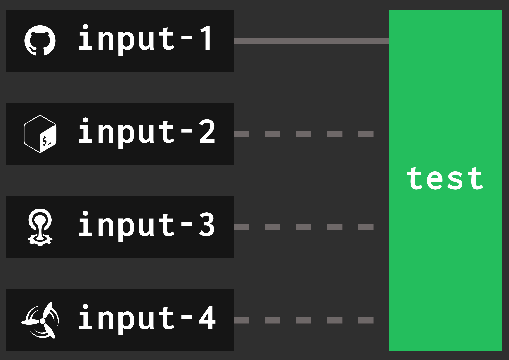
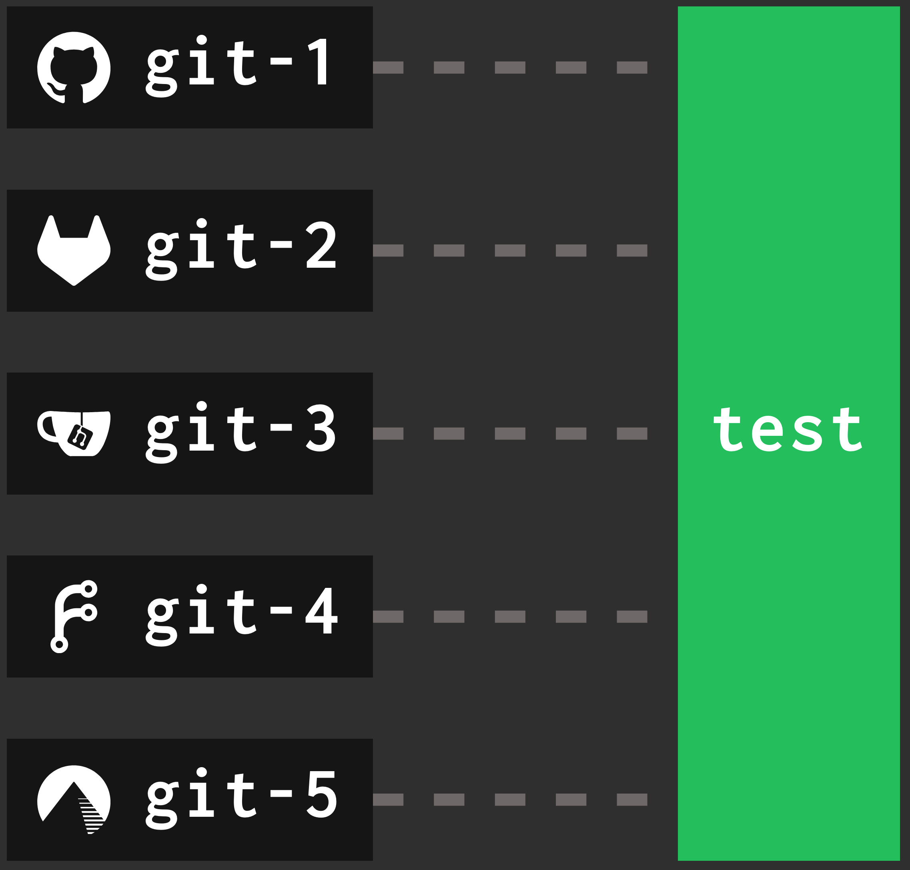

[v8.2.0](https://github.com/concourse/concourse/releases/tag/v8.2.0) has been
released. This release was brought to you by 42 PR's from 20 contributors, four
of them first-time contributors. Thank you to everyone that contributed to this
release!

As usual, I'll go over some of the bigger and more exciting changes. Read the
[release notes](https://github.com/concourse/concourse/releases/tag/v8.2.0) on
GitHub for a full rundown of what's new and fixed.

<!-- more -->

## Thank You Patrons!

I want to start by thanking all the users and organizations that currently
[support my work](https://github.com/sponsors/taylorsilva) on Concourse, as
well as all my corporate clients.

If your organization uses Concourse and could benefit from technical support,
training, or consulting in relation to Concourse, please reach out to me at
[taylor@pixelair.io](mailto:taylor@pixelair.io).

If you're a smaller team or organization that wants to ensure the continued
development of Concourse, you can sponsor me on
[GitHub](https://github.com/sponsors/taylorsilva).

Let's get on with all the shiny new features!

## 🤹 Smarter Resource Checking - [#9492](https://github.com/concourse/concourse/pull/9492)

The TLDR of this change is: Concourse will only regularly check **triggering**
resources. All other input resources for jobs will be checked when the job is
triggered. This means less hammering of external systems and less chance of
hitting rate limits of third-party services.

Previously, if you had a simple pipeline with resources like this:


/// caption
Concourse job with 4 input resources. Only `input-1` triggers the job.
///

All four resources would be regularly checked every one minute (on a Concourse
with default settings).

Starting in v8.2.0, that same pipeline will only have its one triggering
resource (`input-1` in this case) checked regularly. The other three resources
will only be checked when the `input-1` triggers the `test` job. That's a 75%
drop in resource checks!

A detailed breakdown about how this was achieved can be [read in the
PR](https://github.com/concourse/concourse/pull/9492). There are a few other
factors I had to consider when implementing this. The project's Concourse at
[https://ci.concourse-ci.org/](https://ci.concourse-ci.org/) has been running
with this new scheduler since April 8th without any unexpected scheduling
behaviour.

Overall, operators should see a drop in the number of resource checks occurring
on their Concourse cluster. The drop will depend on how many triggering vs
non-triggering resources you have.

## 👥 All fly CLI Commands have the `--team` Flag - [#5215](https://github.com/concourse/concourse/issues/5215)

Thanks goes to [Izabela](https://github.com/izabelacg) for making the two PR's
that finally closed out that issue. The way `fly` was structured made this a
tedious chore, but after 6 years it's finally closed out. It has served as a
`good-first-issue` for many contributors over the years.

## 👤 New `user_data` Field Added to Pipelines - [#9489](https://github.com/concourse/concourse/pull/9489)

Pipeline authors can now use a new top-level field, `user_data` in their
pipelines to store arbitrary information about a pipeline. This data will be
stored in Concourse's database. The PR includes this example:

```yaml
jobs:
  - name: build
    plan:
      - task: test
        config:
          platform: linux
          run:
            path: echo
            args: ["hello"]

user_data:
  organization: Platform Team
  contact: platform@example.com
  labels:
    - production
    - critical
  metadata:
    cost_center: CC-1234
    region: us-west-2
```

The items in `user_data` are not used by Concourse. When you `fly
get-pipeline`, if it has `user_data`, it will be returned with the rest of the
pipeline.

## 🚦 New `BUILD_STATUS` for Resources - [#9523](https://github.com/concourse/concourse/pull/9523)

Resources get access to build metadata, like the job and pipeline name, build
ID, build URL, etc., via environment variables. Now there's a `BUILD_STATUS`
environment variable that resources can use to take action based on the value.

`BUILD_STATUS` is only present when used in one of the `on_*` hook steps, at
either the step or job level. It will have a value of
`success/failure/aborted/errored`.

This is useful for resources that send notifications. These resources usually
require you manually pass in the status, but now resources can look-up the
`BUILD_STATUS` env var to get the status of the build and take the appropriate
action.

## 📢 Operators Can Set the Broadcast Message From the Web UI - [#9484](https://github.com/concourse/concourse/pull/9484)

Users with the `Owner` role on the `main` team will see a new bullhorn icon in
the Concourse web interface in the top-right. Pressing that button will allow
the user to set, update, or clear the broadcast message for their Concourse
cluster.


/// caption
Image showing the broadcast button in the web UI
///

## ⏸️ Operators Can Pause Web Components - [#9544](https://github.com/concourse/concourse/pull/9544)

This is our answer to "how can I pause all pipelines in my Concourse cluster?".
The answer is now `fly pause-component --runtime-components`.

Concourse web nodes are made up of multiple internal components that work
together to run pipelines and manage the workers. Technically, it has always
been possible to pause these components by going into the database and running:

```sql
UPDATE components
SET paused = true;
```

Buy running queries againist a database schema you're not familiar with feels
sketchy. Now we've wrapped this in some `fly` commands for operators to safely
use.

Operators can view the state of all components by running `fly get-components`.

The `fly pause-components` command has some convenience flags so operators don't need to intimiatly know what each component does:

```
[pause-component command options]
-a, --all                 Pauses all components
-n, --name=               Name of the component(s) to unpause. Can specify multiple times to pause multiple components
    --runtime-components  Pauses all components related to starting and running pipelines. Pause these before upgrading Concoure.
    --gc-components       Pauses all components related to garbage collection of data in the database, and artifacts (container, volumes) on Workers.
```

Pausing components does not cause jobs to be aborted. Anything in-flight will
keep running until completion, but nothing new will start. Users can still
trigger jobs and set pipelines, but jobs will stay in the pending state.


## 🏎️ Speed Round! 

It's hard not to make this blog post a repeat of all the features in the
release notes. For the sake of brevity, here's a list of the remaining features
I'm excited about:

- Task cache's have a TTL now - [#9533](https://github.com/concourse/concourse/pull/9533)
    - Can be configured in the task config or at a global level using `CONCOURSE_DEFAULT_TASK_CACHE_TTL`
- Reduce the number of API calls Concourse makes to Vault by enabling `CONCOURSE_VAULT_ENABLE_KV_MOUNT_CACHE` - [#9530](https://github.com/concourse/concourse/pull/9530)
    - Concourse makes a preflight check on a secret to figure out if it's in a kv1 or kv2 store. Enabling this feature caches the result of this preflight.
- The "Download Fly" page now includes some "Getting Started" steps - [#9545](https://github.com/concourse/concourse/pull/9545)
- Concourse can use Gitea/Forgejo as an authentication provider - [#9558](https://github.com/concourse/concourse/pull/9558)
- Added brand icons from Simple Icons - [#9564](https://github.com/concourse/concourse/pull/9564)
    - Use any icon from Simple Icons by using the prefix `si/` followed by the slug from [simpleicons.org](https://simpleicons.org/)


/// caption
Pipeline with resources showing off brand icons from Simple Icons
///

## ✈️ Enjoy the Release!

If you run into any issues please post in our [GitHub Discussions
board](https://github.com/orgs/concourse/discussions/categories/help-support)
or on [Discord](https://discord.gg/MeRxXKW). Checkout the
[Roadmap](https://github.com/orgs/concourse/projects/53) to see what's coming
up next.
