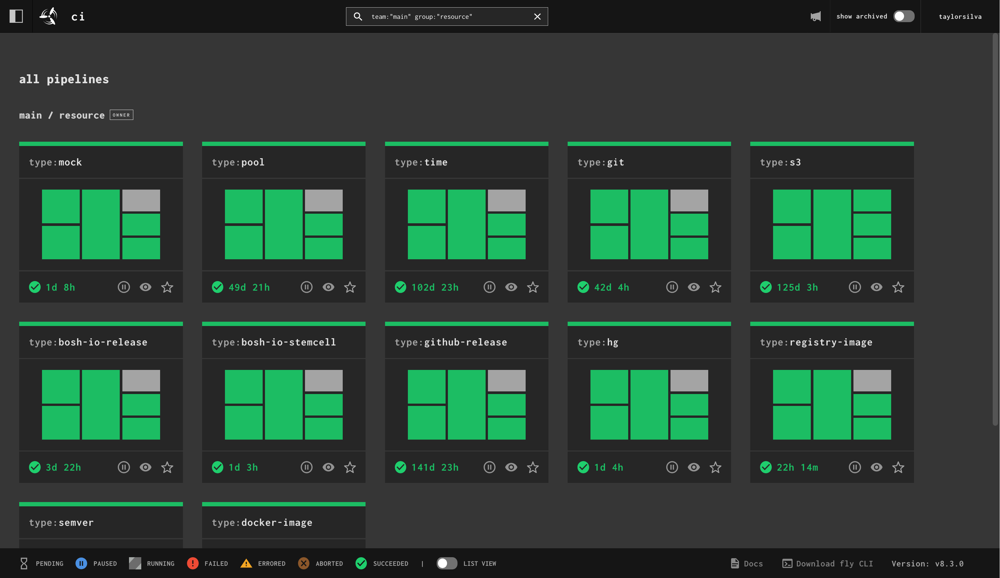
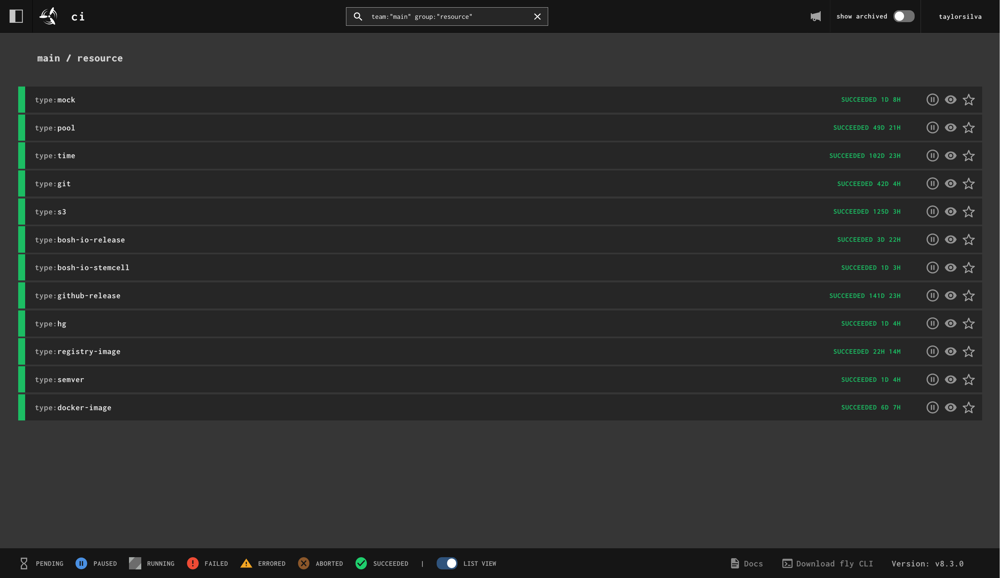
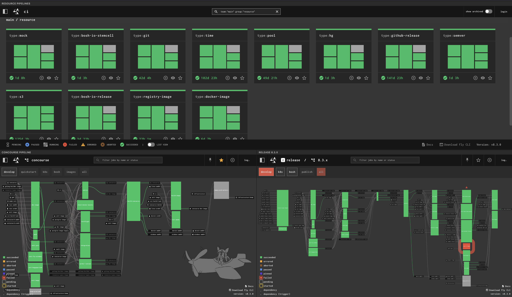
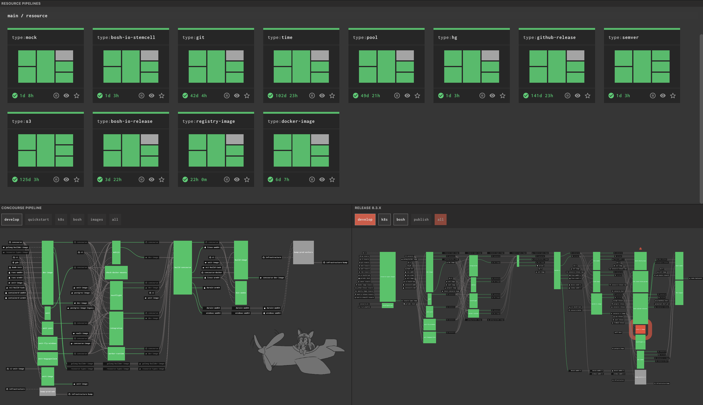

[v8.3.0](https://github.com/concourse/concourse/releases/tag/v8.3.0) has been
released. This release was brought to you by 50 PRs from 13 contributors, seven
of them first-time contributors. Thank you to everyone who contributed to this
release!

Read the [release
notes](https://github.com/concourse/concourse/releases/tag/v8.2.0) on GitHub
for a full rundown of what's new and fixed. The rest of this post will go over
the biggest features I'm excited about in this release.

<!-- more -->

## Thank You Patrons!

My work on Concourse is made possible by those who sponsor me on
[GitHub](https://github.com/sponsors/taylorsilva), as well as my corporate
clients. Thanks go to all of you for supporting the maintenance and development
of Concourse!

If your organization uses Concourse and could benefit from technical support,
training, or consulting in relation to Concourse, please [reach out to
me](https://pixelair.io/contact/). I still have capacity for more corporate
clients.

If you're a smaller team, or an organization that just wants to ensure the
continued development of Concourse, you can sponsor me on
[GitHub](https://github.com/sponsors/taylorsilva) or [contact
me](https://pixelair.io/contact/) for other sponsorship options. Any and all
support is greatly appreciated 🙏

Now let's go over all the new features and changes in this release. I've split
these up by "user-facing" and "operator" features. Feel free to jump to the
section that's relevant to you.

## User-facing Features

### Job and Step-level `tags` - [#9606](https://github.com/concourse/concourse/pull/9606)

The `tag` step modifier, used for telling Concourse to run a particular step on
a worker with matching tag(s), has previously been very verbose to use. If you
wanted to tag multiple steps you had to tag each step individually, like this:

```yaml
jobs:
- name: my-job
  plan:
    - in_parallel:
      - get: repo
        tags: ["minty"] # TAG!
      - get: ci
        tags: ["minty"] # TAG!
      - get: image
        tags: ["minty"] # TAG!
```

Which can be really annoying if your job has a lot of steps and you want them
all tagged. The above example can now be re-written at the step-level, using
the `do` or `in_parallel` steps, like this:

```yaml
jobs:
- name: my-job
  plan:
    - tags: ["minty"] # All the tags, none of the mess ✨
      in_parallel:
      - get: repo
      - get: ci
      - get: image
```

Or at the job-level which will tag all steps in the job:

```yaml
jobs:
- name: my-job
  tags: ["minty"] # Much tags, little typing!
  plan:
    - in_parallel:
      - get: repo
      - get: ci
      - get: image
```

That should help [DRY](https://en.wikipedia.org/wiki/Don%27t_repeat_yourself)
up your pipelines!

### Pipeline Instance Groups get a List View - [#9626](https://github.com/concourse/concourse/pull/9626)

This PR actually made a couple of changes, but the big one is that pipeline
instance groups have a list view option now. If you navigate to an instance
group you'll see the same grid layout like on the main dashboard. There is no
HD view option for instance groups like there is for the main dashboard.


/// caption
Pipeline instance group displayed with the default grid view.
///

In the footer of the page there is now a "List view" toggle which will render
the pipelines in a list, one instance pipeline per line:


/// caption
Pipeline instance group displayed with the list view.
///

The other change also introduced is that the `/hd` path has been removed and we
instead persist the state of the HD and list view toggles in your browser's
local storage. The state of both toggles are independent from each other.

Thank you [@bcersows](https://github.com/bcersows) for this feature!

### Hide UI Elements - [#9625](https://github.com/concourse/concourse/pull/9625)

Back in the pre-covid days, it was quite common for teams using Concourse to
have large monitors or TVs displaying their Concourse pipelines. If users had
multiple pipelines they wanted to monitor they would make local HTML pages with
`iframe`'s displaying all their pipelines, or have multiple browser windows
open. They would look something like this:


/// caption
Static HTML page with three iframes showing three different Concourse
pipelines. UI elements such as the top navigation bar are visible in all three
iframes.
///

This worked fine except for the fact that all the UI elements, particularly the
top navigation, are repeated three times, taking up a lot of visual real
estate. One of the oldest issues I had left open,
[#1477](https://github.com/concourse/concourse/issues/1477), asked for a way to
hide the extra UI elements.

You can now hide the UI elements on any Concourse page by adding
`?hide_ui=true` to the URL. The iframe page above now looks like this:


/// caption
Static HTML page with three iframes showing three different Concourse
pipelines. UI elements are not visible in any of the iframes.
///

### Task Volumes Will be Owned by Non-root Users - [#9593](https://github.com/concourse/concourse/pull/9593)

This feature closes one of the oldest and most +1'd issues in the repo: [Issue #403](https://github.com/concourse/concourse/issues/403)

Previously, when you ran a task as a non-root user, any `input`, `output`, and
`cache` volumes would **not** be owned by that user. They would instead be
owned by `root`, which would then result in some kind of permission error when
trying to read/write files from the volume.

Users made workarounds, the main one being to start the task as `root`, `chown`
the volumes to your desired user, and then run your actual task script under
the desired non-root user. Lots of duct tape holding that together. None of
these workarounds are necessary anymore!

Now Concourse will recognize if a task starts with a non-root user and will
`chown` the volumes to that user's UID/GID. No more permission issues when
reading/writing files to your task's volumes.

The only thing to watch out for is in regard to `output` volumes. When passed
to other task or step containers, `output` volumes will still be owned by the
non-root user. This shouldn't be an issue if the later container is running as
`root`, and in the case where you're running as a different non-root user, the
volume(s) will be `chown`'d again to the new non-root user. This is just a
small permission thing that one should be aware of when passing volumes from
containers that ran with a non-root user.

This is the only breaking change in this release, and I'm hopeful it won't
cause any issues for any existing pipelines. If something does break, please
[open an issue](https://github.com/concourse/concourse/issues)!

### Git Resource Tracks Branches and Tags - [concourse/git-resource#474](https://github.com/concourse/git-resource/pull/474)

I've made a structural change to the git resource (that is backwards
compatible) that allowed me to add two new features to it:

- Track tags across all branches in a repository
- Track branches in a repository

If you look at the
[README](https://github.com/concourse/git-resource/blob/master/README.md) for
the git resource, you'll find a new top-level key called `version_type`. It has
a default value of `commits` which represents the original behaviour of the
resource: track commits on a specific branch. It's the two new values, `tags`
and `branches`, which may be of interest to some users.

The `commits` version type only allowed you to track tags that were on the
specified branch. It was also very slow at finding tags since it had to go
through hundreds of commits just to find tags. On large repositories a check
could take minutes to complete and not even turn up all matching tags.

The `tags` version type allows us to take a smarter and faster approach to
finding tags. Checking the same large repository for tags (I tested this with
the [golang/go](https://github.com/golang/go) repo), the check completed in a
few seconds AND found all matching tags in the repository.

The last version type, `branches`, finds all matching branches in the
repository and produces a `branches.json` in the `get` step. This is useful for
passing into the `across` step and setting pipelines based on branch names.

## Operator Features

### Automatically Prune Stalled Workers - [#9604](https://github.com/concourse/concourse/pull/9604)

There is now a `CONCOURSE_STALLED_WORKER_TIMEOUT` that you can set on your web
nodes. This is an opt-in feature that is off by default. It takes [Go
time.Duration](https://pkg.go.dev/time#ParseDuration) values.

When configured, any worker that is in the `stalled` state longer than the
timeout will be automatically pruned by the web nodes. No need to manually run
`fly prune-worker` anymore!

### Detailed Health Endpoint - [#9588](https://github.com/concourse/concourse/pull/9588)

There is now a `/api/v1/health` endpoint that gives detailed health information
about the cluster. The endpoint is not complete yet, but it is useful already
for understanding the basic health of your Concourse cluster. Keep an eye out
for more PRs from [@Kump3r](https://github.com/Kump3r) as he continues to work
on this.

### Workers Can Specify Their Own Max Tasks - [#9627](https://github.com/concourse/concourse/pull/9627)

There's been a container placement strategy called `limit-active-tasks` that
I've seen to be very useful for not overloading workers. With that strategy
set, you could also set `CONCOURSE_MAX_ACTIVE_TASKS_PER_WORKER` and the web
nodes would enforce that limit across all workers. This works fine but it
assumes all workers are the same size of compute. In larger clusters this is
usually not true, workers may come in all sorts of sizes.

Workers now have a way of telling the web nodes the max number of tasks they
will accept by setting `CONCOURSE_MAX_ACTIVE_TASKS` on your worker(s).

`CONCOURSE_MAX_ACTIVE_TASKS_PER_WORKER` on the web node acts as the default
value in this case, with `CONCOURSE_MAX_ACTIVE_TASKS` overriding it on a per
worker basis. You must be using the `limit-active-tasks` placement strategy,
otherwise this new setting will have no effect.

### Automatically Destroy Archived Pipelines - [#9630](https://github.com/concourse/concourse/pull/9630)

This is another opt-in feature that is off by default. When
`CONCOURSE_DESTROY_ARCHIVED_PIPELINES_AFTER` is set on your web nodes, any
archived pipelines that have been archived for longer than the given duration
([Go's time.Duration](https://pkg.go.dev/time#ParseDuration) format) will be
deleted.

This is a handy way to ensure your database doesn't grow forever, especially if
you make liberal use of the pipeline archiving feature from the `set_pipeline`
step.

## Everything Else

Last few things I'd like to shout-out related to this release:

- Thanks to [@VikranthBala](https://github.com/VikranthBala) for adding `--*-shared-path` flags to the Credhub and Kubernetes secret managers ([#9615](https://github.com/concourse/concourse/pull/9615), [#9643](https://github.com/concourse/concourse/pull/9643)), bringing them into feature parity with all the other credential managers.
- Thanks to [@aliculPix4D](https://github.com/aliculPix4D) and the folks at Pix4D for fixing up a bunch of things related to volume streaming on Windows workers
    - Their work here resulted in us discovering two bugs in Go! See [golang/go#80073](https://github.com/golang/go/issues/80073) and [golang/go#80308](https://github.com/golang/go/issues/80308)
- Both [@IvanChalukov](https://github.com/IvanChalukov) and [@Kump3r](https://github.com/Kump3r) are the first outside contributors to get Approver status in the `concourse/concourse` repo. They've proven to be good stewards of the project and have made many contributions at this point.
- Thanks to [@kcbimonte](https://github.com/kcbimonte) for his continued work on helping maintain the docs. He's also been elevated to Approver status for the `concourse/docs` repo.

If you find any bugs or regressions please let us know in our GH Discussion
forum:
[https://github.com/orgs/concourse/discussions](https://github.com/orgs/concourse/discussions)

Enjoy the release and may your pipelines be ever green! ✈️
