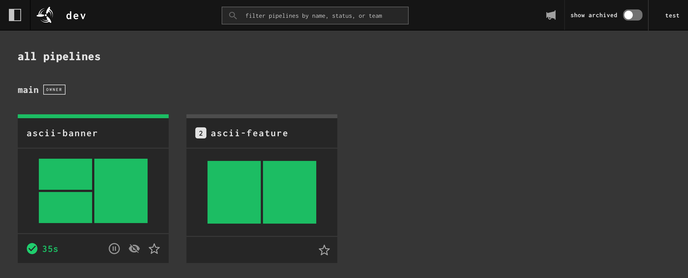
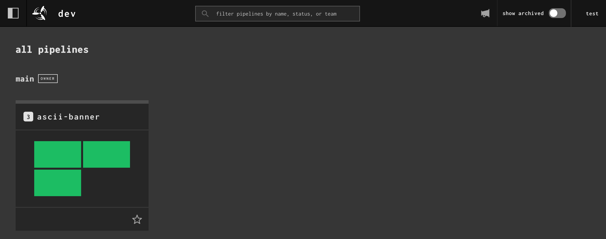
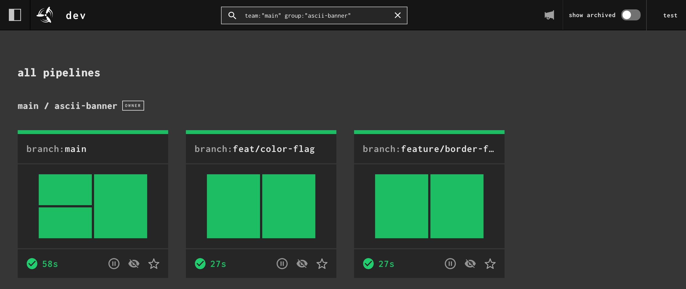

Teams may make use of multiple branches for their development. For instance,
some teams create feature branches while working on new functionality - once
this functionality is ready, the branch will be merged into the main branch and
the feature branch will be deleted.

While a feature is under development, you'll often want to run tests against
the feature branch. To model this in Concourse, you'll need to have a pipeline
for each active feature branch. Manually setting (and eventually archiving) a
pipeline for each feature branch would be quite a burden. For this type of
workflow, Concourse has a few important tools to help you out: the
[`set_pipeline` step](../../steps/set-pipeline.md), [
`across`](../../steps/modifier-and-hooks/across.md), and [instance
pipelines](../../pipelines/grouping-pipelines.md).

In this guide, we'll cover:

1. Writing a pipeline to [Test and Build](#test-build-deploy) a feature branch.
1. Automatically creating pipelines for each feature branch from a "parent"
   pipeline. We'll use the [git
   resource](https://github.com/concourse/git-resource/), [`set_pipeline`
   step](../../steps/set-pipeline.md), and [`across`
   step](../../steps/modifier-and-hooks/across.md) to create instance
   pipelines.
1. Cleaning up pipelines once feature branches are merged and deleted.

We'll use [this example Go
app](https://github.com/concourse/examples/tree/main/apps/golang) for testing
and building in our pipeline. It's just a silly CLI that prints ASCII banners,
similar to [cowsay](https://en.wikipedia.org/wiki/Cowsay).

## The Feature Branch Pipeline

First we will write a pipeline that will test and build against commits on a
single feature branch. We only need two resources in our pipeline:

1. A `git` resource that will track and fetch commits from our feature branch.
   The `((branch))` is how we'll tell the pipeline which feature branch to
   track.
1. A `registry-image` resource that will pull the [golang
   image](https://hub.docker.com/_/golang) to test and build our example app.

We'll then have two jobs:

1. The first job will run unit tests using this task file which runs `go test`:
    ```yaml linenums="1" title="go-test.yml"
    --8<-- "libs/examples/tasks/go-test.yml"
    ```
1. The second job will compile and run the binary using these two task files.
   The first runs `go build` and tars up the final binary into a `.tgz` file.
   Both the binary and the tgz are saved in the output directory `binary`.
    ```yaml linenums="1" title="go-build.yml"
    --8<-- "libs/examples/tasks/go-build.yml"
    ```
    The second task here takes the compiled binary and runs it. The task will
    fail if the binary fails to run (`exit 1`).
    ```yaml linenums="1" title="binary-test.yml"
    --8<-- "libs/examples/apps/golang/binary-test.yml"
    ```

Putting all of that together we get our pipeline for the feature branches.
```yaml linenums="1" title="template.yml"
--8<-- "libs/examples/pipelines/multi-branch/template.yml"
```

Next we'll create the pipeline that will create the instance pipelines using
`template.yml`.

## Automatically Creating Feature Branches

The pipeline that creates other pipelines is what we call the "parent
pipeline". Our parent pipeline will include one extra resource and job compared
to the previous pipeline config we made above. Along with creating the instance
pipelines, this pipeline will also test and build all commits that get merged
into the `main` branch. We're doing this to demonstrate that all instance
pipelines don't all need the same pipeline configuration.

The extra resource we'll include is going to track branches from our git
repository. We'll use the [`git`
resource](https://github.com/concourse/git-resource/) with
`source.version_type` set to `branches`. By default it'll find all branches in
the repository, so we'll also set `source.branch_filters` to filter to a subset
of branches; those starting with `feat/` or `feature/`.

We'll then use that resource in a job called `set-feature-pipelines` and use
the `across` and `set_pipeline` steps to create one instance pipeline per
branch.

Here's what our parent pipeline's configuration looks like all put together:

```yaml linenums="1" title="parent.yml"
--8<-- "libs/examples/pipelines/multi-branch/parent.yml"
```

You can then set the parent pipeline in two ways: as an instance pipeline that
will live alongside the instance pipelines it creates, or as a separate
pipeline under a different name. Either way is fine, it won't make a difference
on the end result.

```sh
# running from the root of github.com/concourse/examples

# setting parent pipeline as a separate pipeline.
# Instance pipelines will be named "ascii-feature"
fly -t ci set-pipeline \
  --pipeline ascii-banner \
  --config pipelines/multi-branch/parent.yml \
  --var instance_pipeline_name=ascii-feature

# or set the parent pipeline as an instance pipeline. Both parent and child
# pipelines are named "ascii-banner" in this situation. We also set an instance
# var for the parent pipeline, though the var is unused in our parent pipeline.
# The instance var will display in the web UI.
fly -t ci set-pipeline \
  --pipeline ascii-banner \
  --config pipelines/multi-branch/parent.yml \
  --var instance_pipeline_name=ascii-banner \
  --instance-var branch=main
```

There are some feature branches in the `concourse/examples` repo, so you should
get a few instance pipelines being made once you set and unpause the parent
pipeline.

If you set the parent pipeline as a separate pipeline, it will look like
this in the web UI:


If you set the parent pipeline as an instance pipeline, it'll appear grouped
with the instance pipelines it creates in the web UI:


Clicking on the instance group will look like this:


Which setup you choose is up to you. They are functionally the same.

## Automatically Archiving Feature Branch Pipelines

The last thing we need to figure out with this setup is how to delete the
instance pipelines when we're done with them. Feature branches will be merged
into `main` at some point and likely deleted too.

Once the feature branch is deleted from the git repository, our git resource
that tracks branches will notice the branch no longer exists and will trigger
the `set-feature-pipelines` job.

`set-feature-pipelines` will run and set/update the pipelines for branches that
still exist. When this happens, Concourse will notice that the instance
pipeline belonging to the deleted feature branch is not being updated by the
parent pipeline anymore; the parent-child relationship between the two
pipelines has been broken. Concourse will automatically archive the feature
branch's pipeline. Archived pipelines are hidden from the web UI and paused.

You can test out the final piece of this workflow by deleting one of the
feature branches in the `examples` repo. Shortly after `set-feature-pipelines`
runs, the pipeline tied to the deleted branch will be archived. You can press
the "show archived" toggle in the web UI to verify this.

That brings us to the end of this guide. Hopefully this has helped illustrate
the basic mechanics required to set up multi-branch workflows using Concourse
pipelines. If you have any thoughts or suggestions, feel free to share them in
our [GitHub Discussions](https://github.com/orgs/concourse/discussions) forum.
