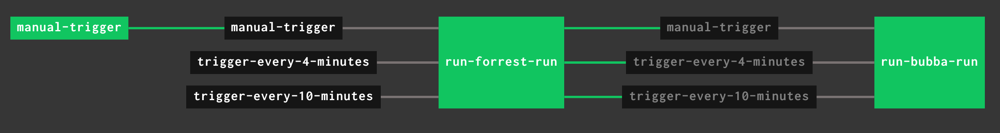

The [`time` resource](https://github.com/concourse/time-resource) produces a new
[version](../../docs/getting-started/resources.md#versions) for the time interval declared in its definition, and
can be used to trigger a job on that schedule.

The two most common configurations are triggering on a fixed interval:

```yaml
resources:
  - name: trigger-every-3-minutes
    type: time
    source:
      interval: 3m
```

or triggering once within a time window:

```yaml
resources:
  - name: trigger-daily-between-1am-and-2am
    type: time
    source:
      start: 1:00 AM
      stop: 2:00 AM
      location: America/Toronto
```

Check the README of the [time resource](https://github.com/concourse/time-resource/) for the full set of options.

See it running:

<div>
  <div style="position:relative;padding-top:40%;">
    <iframe src="https://ci.concourse-ci.org/teams/examples/pipelines/time-triggered?hide_ui=true" allowfullscreen
      style="position:absolute;top:0;left:0;width:100%;height:100%;border:0"></iframe>
  </div>
</div>

## Minimal Time-Triggered Pipeline

The simplest possible version: one `time` resource on an interval, and one job that triggers off it. This is the
exact pipeline deployed above:

```yaml linenums="1"
--8<-- "libs/examples/pipelines/time-triggered.yml"
```

## Chaining Jobs off a Shared Trigger

A common next step is having a second job run after the first, using the same time resource as its trigger and a
`passed` constraint to enforce ordering:

```yaml
resources:
  - name: trigger-every-3-minutes
    type: time
    source:
      interval: 3m

jobs:
  - name: run-forrest-run
    plan:
      - get: trigger-every-3-minutes
        trigger: true
    # can add other steps to run in this job

  - name: run-bubba-run
    plan:
      - get: trigger-every-3-minutes
        trigger: true
        passed:
          - run-forrest-run
    # can add other steps to run in this job
```


## Multiple Time Triggers

As an enhancement to the job-chaining pattern above, this example implements two time resource triggers plus the ability
to manually kick off the pipeline outside the time resources' schedules.

The first time you set up a pipeline like this, you'll need to manually trigger it in order to satisfy the `passed`
constraint of the `manual-trigger` resource. Once one version is available that satisfies the constraint, all future
triggers by the other resources will work as expected.

```yaml
resources:
  - name: trigger-every-4-minutes
    type: time
    source:
      interval: 4m
  - name: trigger-every-10-minutes
    type: time
    source:
      interval: 10m
  - name: manual-trigger
    type: time
    source:
      interval: 1m

jobs:
  - name: manual-trigger
    plan:
      - put: manual-trigger

  - name: run-forrest-run
    plan:
      - get: trigger-every-4-minutes
        trigger: true
      - get: trigger-every-10-minutes
        trigger: true
      - get: manual-trigger
        trigger: true
        passed:
          - manual-trigger
    # can add other steps to run in this job

  - name: run-bubba-run
    plan:
      - get: trigger-every-4-minutes
        trigger: true
        passed:
          - run-forrest-run
      - get: trigger-every-10-minutes
        trigger: true
        passed:
          - run-forrest-run
      - get: manual-trigger
        trigger: true
        passed:
          - run-forrest-run
    # can add other steps to run in this job
```



## References

* [Resources](../../docs/resources/index.md)
* [Jobs](../../docs/jobs.md)
* [Steps](../../docs/steps/index.md)
* [Tasks](../../docs/tasks.md)